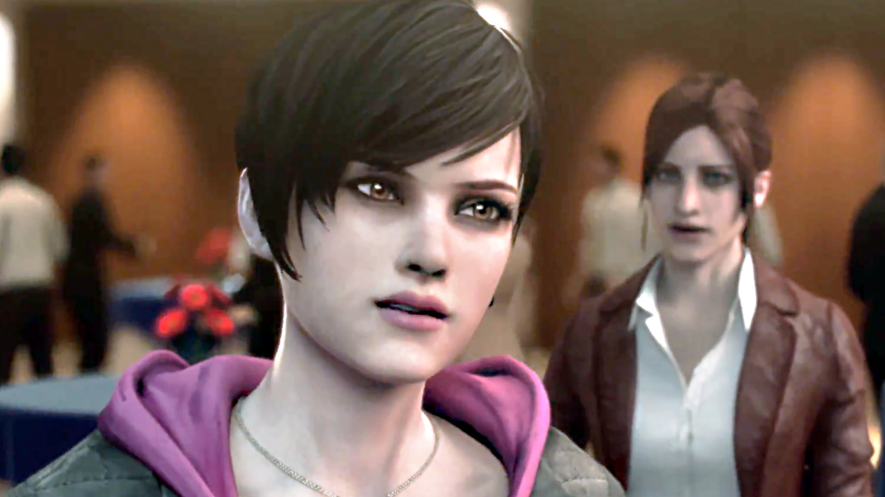
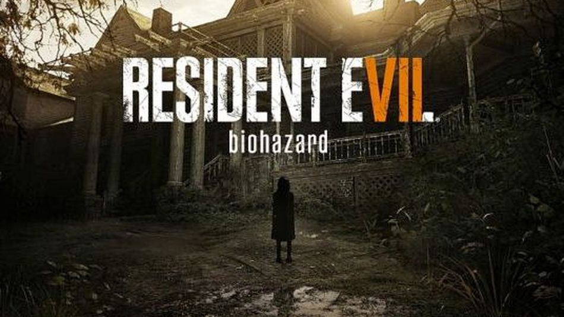

## 生化危机（游戏）
生化危机（Biohard，又名 Resident Evil）是由 CAPCOM（卡普空，俗称卡婊）开发的游戏，热销世界成为著名丧失 IP。

游戏正史分 0-7 代，除正史外还有重制版（炒冷饭系列）、启示录、CG 电影等内容。

今天非日常君就给大家碎片化简单介绍下生化危机的<del>剧情</del>病毒。

>注：
>
>1. 非日常君并非资深生化迷，内容非常不完整，也不保证准确（可以理解为本人瞎扯，* 打头的尤其是）。
>2. 真人电影版生化危机由于剧情画风已与游戏正史相差太大，不加以介绍。
>3. 以下内容包含部分剧透，请紧张地往下看。
>4. 生化危机是游戏...不要因为情景真实就当成现实 @_@

 

### 万恶之源 —— 保护伞公司（Umbrella，又译安布雷拉）

>游戏内容：0~3代，5代，安布雷拉编年史，安布雷拉黑暗历代记，启示录2
>
>

事情起源于遥远的过去，保护伞创始三人组 *奥斯威尔·E·斯宾塞 (Ozwell E. Spencer)* 、 *詹姆斯·马库斯 (James Marcus)* 、 *爱德华·亚希福特 (Edward Ashford)* 在非洲大陆发现一种奇异的病毒，这种病毒后被命名为始祖病毒。

两人马上意识到将这种病毒用于军事上的巨大用途，为了得到研究资金，三人组成立了保护伞公司，并组建私人军事子公司，由高度训练的安全部队武力保护其资产及高层雇员。

>保护伞公司
>
>保护伞公司由三个主要部门组成：
>
>1. 红伞：准军事化部门 + IT 部，提供公司武装力量和计算机保障研究工作，主要成果——超级 AI *红后 (Red Queen)*（电影中的红色小萝莉，著名语句 *You're all going to die down here.* ）。
>2. 蓝伞：生化武器相关的药物和试剂研究。
>3. 白伞：研究 *B.O.W. (Bio-Organic Weapon，有机生化武器)* 和病毒本身。其中最著名的研究组就在 *浣熊市 (Raccoon City，又译莱肯市)* （就是被核弹炸了的那个) 。
>
>对外：大、有钱、复杂、隐秘。  
>对内：高层各怀鬼胎。

#### 重大事件
1. 水蛭女王  
	马库斯在创立安布雷拉后出任浣熊市研究所负责人，之后便一直进行始祖病毒的研究，1977年病毒与水蛭DNA结合取得了突破性进展，产生的新病毒被命名为 *T病毒* 。
	
	随着研究的进展，马库斯的人格也慢慢产生了扭曲，他已不满足仅仅以动物进行试验，而是将目光瞄准了人类，目标有浣熊市市民甚至安布雷拉后备干部。同时马库斯也发现有人在偷偷观察他的研究进展，并猜到是斯宾塞所为。
	
	1978年，马库斯求助得意弟子 *威廉·柏金 (William Birkin)* 和 *阿尔伯特·威斯克(Albert Wesker)* ，计划在董事会上公布T病毒以公开夺权，奈何威廉和威斯克本来就是斯宾塞的卧底。马库斯的计划尚未完成之时，斯宾塞指示威廉和威斯克带领特种部队暗杀了马库斯，并接手T病毒的研究。在临死前，马库斯看到了威廉和威斯克的身影，暗杀完成后尸体被扔进了实验室的下水道。
	
	然而在下水道中，病毒作用下的变异水蛭侵入马库斯的尸体，20年间吸收同化马库斯DNA并复活马库斯成为水蛭女王。
	
	>水蛭女王
	>
	>雌雄同体，外貌可变成年轻时的马库斯，思考方式、人格、智力都能达到马库斯生前的水准，具备语言沟通能力，能指挥水蛭集体行动。
	>
	>拥有三种形态，在无光环境下几近无敌。
	>
	>
	
	复活后的马库斯开始计划报复安布雷拉的计划。
	
	1998年，在马库斯的破坏下，阿克雷研究所、洋馆、浣熊市地下处理场等地相继病毒泄露。事态渐至无法控制。 阿克雷研究所主任约翰被感染死亡。
	
	7月23日，马库斯指挥水蛭袭击了安布雷拉途经阿克雷山区的列车。
	
	在安布雷拉干部培训所，马库斯通过监控对威廉和威斯克叙述他对安布雷拉的报复，威廉和威斯克意识到脱离安布雷拉的时间快成熟了（他俩之前就有脱离安布雷拉的念头）。
	
	马库斯后来被瑞贝卡和比利成功消灭，干部培训所也被炸毁。*（生化危机0代剧情）*

1. 洋馆事件  
	>洋馆
	>
	>安布雷拉设在浣熊市郊阿克雷山区的名义上的休养所，但实际上是秘密生化实验室。
	>
	>1963年由斯宾塞聘请建筑师乔治·特利博尔建造，但在洋馆建成后为了保守内部的秘密，借邀请特利博尔全家至洋馆度假的理由将其囚禁，建筑师妻女被植入始祖病毒变异株，成为第一代生化试验品，建筑师本人在洋馆密道里绝望死去。
	>
	>随后特利博尔妻子因多种致命病毒而死，女儿 *Lisa* 却与病毒成功融合丧失意识，一直作为试验品囚禁（直至最后洋馆爆炸才死去）。
	>
	>Lisa 是生化史上非常悲惨的人物，在发疯后仅存的就是对母亲的强烈思念，具体情节太悲惨不给出了，但安布雷拉凭这条罪状就永远无法被原谅。
	
	安布雷拉实验动物逃逸至浣熊市效，导致一些动物感染T病毒，并最终袭击人类。  
	
	浣熊市警察局起初认为这是人为的连环杀人案件，派遣 S.T.A.R.S 两个小队（阿尔法，贝塔）进入该地区调查，在经过与丧尸犬的战斗后逃入洋馆。
	
	其实这整个事件都是由安布雷拉安插在浣熊市警察局的威斯克（阿尔法小队队长）与其在安布雷拉的同事，威廉·博肯的阴谋，为的是利用 S.T.A.R.S 提取T病毒作为生化兵器的实战数据。
	
	在幸存的阿尔法小队的克里斯和吉尔的努力下，他们的阴谋破灭，威斯克被实验室中的实验体暴君所杀（这里是假死，详情在下），洋馆也被毁灭。

1. 浣熊市事件
	>浣熊市
	>
	>1963年，斯宾塞在浣熊市阿克雷山区建立洋馆。
	>
	>1968年，斯宾塞在浣熊市建立地下研究所。
	>
	>1976年，安布雷拉在阿克雷山区建立阿克雷研究所及干部培训所，马库斯任负责人。
	>
	>1991年，威斯克作为安布雷拉卧底加入浣熊市警察局。
	>
	>1992年，安布雷拉正式进驻浣熊市，对浣熊市进行大规模经济援助，逐渐成为浣熊市的经济支柱，超过50%工作岗位由安布雷拉提供。
	>
	>1993年，浣熊市警察署长收受安布雷拉大量贿赂，帮助其掩盖不道德行为，城市开始时常出现人口失踪。失踪人口皆为安布雷拉所绑架并用于活体研究。
	>
	>在数十年时间里，浣熊市实际上已成为安布雷拉的附庸，城市的大部分属于保护伞公司的研究设施，经济完全依赖保护伞公司，地下更有规模宏大的保护伞公司秘密研究设施和处理工厂。

	 

	>浣熊市
	>
	>
	
	1998年5-8月，由于复活后的马库斯报复、威廉柏金的过度研究需要、安布雷拉测试生化武器威力等种种因素影响下，阿克雷山区，包括安布雷拉研究所、生化处理厂，均爆发了病毒感染事件。
	
	9月，威廉柏金在G病毒的研究上取得进展，意向脱离安布雷拉并卖掉美国军方，被斯宾塞派遣特别部队追杀并夺取G病毒（剧情是不是很熟悉！）。
	
	临死前威廉往自身注入G病毒，变异狂怒后的威廉杀死了特遣部队除 *死神汉克 (Hunk)* 外的所有成员，并打碎了T病毒与G病毒的试管，在下水道被老鼠吞食。然而G病毒还是被汉克成功回收。
	
	携带T病毒和G病毒的老鼠通过下水道引回地表，由于T病毒的传播能力惊人，在两个星期内浣熊市几乎所有市民均被感染，成为行尸走肉。
	
	在病毒爆发后，安布雷拉派遣特别部队协助浣熊市警察和美国军方处理生化危机，但暗地里却在秘密测试B.O.W.的实战数据（包括T病毒感染的丧尸、丧尸犬、舔食者，以及T病毒制品暴君、复仇女神等）并收集实验数据，在城市感染后期极力毁灭安布雷拉实验数据，并消灭仍存活的 S.T.A.R.S. 生还者。
	
	浣熊市所有救援行动都宣告失败，最后被美国政府使用核弹炸毁（在真人电影中是被安布雷拉自己的军队使用核弹毁灭证据）。
	
	>浣熊市生还者（几乎个个都是打不死的小强）
	>
	>1. *里昂·斯科特·肯尼迪 (Leon Scott Kennedy)* ，多代主角
	>1. *克莱尔·雷德菲尔德 (Claire Redfield)* ，*克里斯·雷德菲尔德 (Chris Redfield)* 兄妹，多代主角
	>1. *雪莉·柏金 (Sherry Birkin)* ，威廉·柏金女儿
	>1. *阿尔伯特·威斯克 (Albert Wesker)* ，著名反派
	>1. *艾达·王 (Ada Wong)* ，亦正亦邪的神秘间谍。  
		最开始的剧情是先死了再被威斯克复活的，后来被卡普空吃书改剧情了，就当她从来没死过吧。
	>1. *汉克 (Hunk)* ，安布雷拉特种部队一员，因多次完成被视为无法完成的任务而被称为死神汉克
	>1. *吉尔·瓦伦蒂安 (Jill Valentine)* ，浣熊市 S.T.A.R.S. 成员。  
	感染过T病毒，但注入血清后没有清除反而让T病毒陷入休眠，T病毒在吉尔体内变异复苏但又神奇消失了，最后因吉尔体内长期与病毒共存而成为超强免疫体，完全免疫病毒。
	>1. *巴瑞·伯顿 (Barry Burton)* ，浣熊市 S.T.A.R.S. 成员。
	>1. 安布雷拉重要人员，极少部分浣熊市官员及普通市民
	>1. ...

#### 雪莉·柏金
> 游戏内容：第2代剧情
> 
> 

威廉·柏金自己注入了G病毒而变异成怪物，在干掉安布雷拉的特遣小队后便大肆破坏。

G病毒变异方向无法预测、无法控制，变异的怪物保留了生物的本能——繁殖，但因G病毒几乎没有传染能力，所以是需要通过幼体植入进行传播。

与宿主相似的基因对宿主的幼体更具有适应性，因此变异后的威廉一直在寻找自己的女儿。

期间，克莱尔在无意中找到雪莉及遇到了雪莉的母亲，雪莉母亲向其讲述了灾难的经过，并想用安布雷拉研制出的疫苗使丈夫变回人类。

随后威廉找到了克莱尔一行人，在打斗过程中威廉杀死了自己的妻子，并成功往雪莉体内植入了G幼体。最终威廉在变异的第五形态被克莱尔杀死。

克莱尔成功取得疫苗并最终救治了雪莉，但雪莉的血液中依然能检测到G病毒的存在，她已经与G病毒完美融合了。受G病毒的影响，雪莉拥有超强恢复能力和对各种病毒的免疫能力，身体的老化也永远停留在二十岁。

由于体内带有G病毒，在浣熊市事件后一直被美国政府软禁，并配合做各种各样的研究。

>在生化危机第6代中，长大成人的雪莉终于被获准成为特别探员，恢复一定程度的自由，处理与生机危机相关事务。
>
>在一次行动中，雪莉乘坐的直升机被击落，巨大的碎片贯穿了胸膛，但强行拔出碎片后，雪莉身体在极短时间内完全痊愈。

#### 亚希福特家族
1971年，安布雷拉创始人之一爱德华·亚希福特在研究始祖病毒过程感染而死，其子 *亚历山大·亚希福特 (Alexander Ashford)* 继承了父亲的地位，但是公司大权逐渐落入斯宾塞一人手中。

1970年，亚历山大创立安布雷拉南极研究所，转向遗传基因研究，顺利让斯宾塞放松戒备。

为复兴家族但接连失败后意识到自己能力有限，因此他运用自己的遗传学知识，提取了家族创始人 *维罗妮卡·亚希福特 (Veronica Ashford)* 的基因，通过人工受精制造出 *阿尔弗雷德·亚西福特 (Alfred Ashford)*、*阿莱克西亚·亚西福特 (Alexia Ashford)* 双胞胎兄妹。

>维罗妮卡·亚希福特，亚希福特家族的创始人，被誉为智慧与美貌的完美结合。
>
>根据后人描述，维罗妮卡在数学、生物和语言学方面有着过人的天赋，在十岁时就已取得了硕士学位并熟练掌握十种语言。
>
>与她接触过的每一个人，都无不被她昳丽的容貌和得体的言行所打动，她的侍从们更是因此宣誓世代效忠于亚希福特家族。
>
>注：维罗妮卡的设定背景是普遍的男权社会，在此背景下依然被纪念为家族创始人，尽管描述有点玛丽苏，但这样的设定正面表达了她的完美，同时反映了家族当前掌门人亚历山大的无能。

亚历山大在制造这两兄妹时，结合了祖先的基因并刻意修改了与智商有关的片段，使其比正常人拥有更高的智力。但由于他是单纯地出于复兴家族的目的，因此对这两兄妹基本没有感情。

双胞胎出生后，亚历山大通过脑电波测量，双胞胎的智力均高于常人，其中哥哥只是比普通人高，但妹妹高得可怕。

>以家族振兴为目的而出生的阿莱克西亚在智商上确实超越了人类的正常范围，但是智力的疯狂提升，会导致在人格的形成上产生较大的错位。
>
>儿童心理学之父皮亚杰所研究的那样，一个人如果在儿童时期过早的担负了远超于其应有年纪的知识，并且被周边给予厚望的时候，儿童的发育很容易造成不健全，在人格上表现为傲慢，在行为上则表现为偏执。
>
>阿莱克西亚的情况恰恰是这样的。过早的背负了本不应该属于她的智商，过早的被周边的亲人过分期待，使得阿莱克西亚开始对周边的一切产生了很大的隔膜和淡漠。
>
>她开始认为这个世界就是一个强者生存的世界，家人、爱这些东西都只是强者之路上的一个个垫脚石而已。因此，在她的童年时期就体现出了强烈的对生命的漠视和社会工具论思想。
>
>但是，人格的扭曲不影响她的天才。在智商上，她是完美的，甚至是可怕的。
>
>在她小时候，她就与众不同，不断跳级，在10岁的时候，从名牌大学获得第一名顺利毕业。
>
>在毕业后被破格任命为安布雷拉南极研究所的主任研究员。

1983年，阿尔弗雷德在家族密室中发现了自己与妹妹的身世，得知自己只是复兴家族的工具，便开始憎恨亚历山大，并将实情告知阿莱克西亚。

同年，12岁的阿莱克西亚通过一种极其特殊的方法，大胆的将始祖病毒与蚁后基因相融合，并挑选部分植物的DNA与之同化，最终成功创造出新型病毒 *T-维罗尼卡 (T-Veronica)*。

得知自己身世的阿莱克西亚并没有特别的激动，冷静地开始与哥哥商量，将自己父亲作为实验体进行T维罗妮卡病毒的试验。对外宣称亚历山大离奇失踪，阿尔弗雷德成为新的家族掌门人。

实验的结果出乎意料，整个实验因为亚历山大的基因排斥问题彻底失败，他自己也变成了一个可怕的生物，被关押在南极研究所地下的牢房里。至此，亚历山大终于咽下了自己所开创的苦果。

虽然实验结果不尽人意，这次试验却让阿莱克西亚了解到了病毒的特性并看到了成功的可能——如果细胞于病毒的融合速度变慢，人体共融在一个所能承受的范围内缓慢进行的话，那么身体排斥的问题就可以解决，试验也就可以成功了。

于是，阿莱克西亚迫不及待的将T-维罗妮卡注射到了自己的身上，并通过冷藏冬眠的方式抑制病毒的急速扩张，使自己的身体细胞和病毒缓慢的融合。唤醒冬眠的唯一“钥匙”交给了哥哥阿尔弗雷德。

这个过程需要15年的时间。如果融合的结果如同阿莱克西亚所预料的那样的话，阿莱克西亚将会成为真正的女皇，而她散播的病毒将使所有人类变成自己的仆人。

在此期间，阿尔弗雷德以感染病毒死亡为由，对外宣称阿莱克西亚已经离世。阿尔弗雷德回到 *洛克福德岛 (Rockford)* 监狱，并被降级为军事训练司令。

>阿莱克西亚
>
>

克莱尔于浣熊市事件后暗中调查安布雷拉的研究，1998年于安布雷拉巴黎研究所被捕，被押送至洛克福德岛监禁。

威斯克叛逃至的神秘组织H.C.F.得知阿莱克西亚与维罗尼卡病毒在洛克福德岛的消息，派遣威斯克轰炸该岛。克莱尔与一名年轻犯人 *史蒂夫 (Steve)* 趁机越狱。克莱尔欲与史蒂夫驾驶水上飞机驶离洛克福德岛，却被阿尔弗雷德遥控被迫与其一起来到南极。

>史蒂夫
>
>父亲是安布雷拉的小职员，因泄露公司机密而全家被捕，母亲被当场杀死。
>
>在洛克福德岛为了救克莱尔而杀死了感染病毒成为丧尸的父亲。在逃离监狱的过程中逐渐与克莱尔互相萌生爱意。

在南极，史蒂夫重伤了阿尔弗雷德，但听到了自己儿子的惨叫，一直被囚禁在地下的亚历山大挣脱了束缚装置，朝着克莱尔和史蒂夫复仇。亚历山大最后被克莱尔和史蒂夫消灭。

阿尔弗雷德用最后的生命唤醒了沉睡中的妹妹，死在苏醒了的妹妹怀里。苏醒了的阿莱克西亚远程控制维罗妮卡感染变异的触手袭击了克莱尔和史蒂夫。

>阿尔弗雷德
>
>阿尔弗雷德拥有病态的恋妹情节，一直仰慕着阿莱克西亚的美貌与智慧，后期因太疯狂而导致双重人格，独自扮演自己和妹妹互相对话。
>
>在最初的情节里，阿莱克西亚唯一对她的哥哥拥有感情，看到哥哥死在自己怀里，愤怒的她立即控制维罗妮卡变异的触手袭击了地表的克莱尔和史蒂夫。阿莱克西亚提前4天被唤醒而最终无法达到维罗妮卡的完美融合。
>
>但在重制版里，阿尔弗雷德依然被设定拥有病态恋妹情节，但阿莱克西亚被设定成一个完全没有感情的人，对她来说，哥哥也只不过是个无能的兵蚁而已。被唤醒后迁怒于哥哥没能及时把自己唤醒，错过了“一场好戏”，直接把阿尔弗雷德杀死。

威斯克与为了寻找妹妹克莱尔的克里斯于洛克福德岛相遇，克里斯惊奇于在洋馆事件后威斯克的复活（之前是假死了，为了骗过安布雷拉）。威斯克此时已经通过始祖病毒变异株获得了惊人的力量、速度和恢复能力，克里斯败于威斯克，但随后在岛中知晓了阿莱克西亚在南极的事，便抛下克里斯前往南极。

威斯克在南极基地中找到了苏醒后的阿莱克西亚，要求其交出维罗妮卡病毒研究资料，但拥有超人力量的威斯克被阿莱克西亚单手打败。

>在初版中，威斯克被阿莱克西亚两招之内轻松吊打。在重制版中虽然依旧被打败了，但实力没有悬殊那么大。
>
>成功融合了T-维罗妮卡病毒的阿莱克西亚几乎处于无敌的状态，身体获得了超强力量，血液在空气中能沸腾自燃当成武器，体表坚硬无比。
>
>阿莱克西亚保留了完整的自我意识和智力，能在人形与维罗妮卡三个变异形态中自由切换。（另一说法是在初版中因提前4天被唤醒，因此并没有那么完美）
>
>幼年的阿尔弗雷德与阿莱克西亚
>
>
>
>

克里斯为了救妹妹也前往南极，在南极成功救了克莱尔，但此时史蒂夫已经被阿莱克西亚注入维罗妮卡病毒疯狂攻击克莱尔。在关键时刻，史蒂夫凭借对克莱尔的爱恢复了部分人性，砍断了自己变异了的触手。但触手随后被阿莱克西亚控制杀死了克蒂夫。

克里斯与克莱尔联手面对阿莱克西亚，但常规武器对阿莱克西亚完全无效，克里斯和克莱尔两兄妹借助阿莱克西亚的父亲亚历山大研制的反B.O.W.线性粒子炮，十分艰难地摧毁了阿莱克西亚的变异第二和第三形态，成功杀死了阿莱克西亚。

>克莱尔
>
>
>
>克里斯
>
>

在南极基地的自毁发生前，克里斯与克莱尔成功逃离，史蒂夫的尸体则被威斯克带走回H.C.F.以提取维罗妮卡病毒。

>亚历山大
>
>意识到自己的无能而制造出阿尔弗雷德和阿莱克西亚两兄妹的亚历山大，在某个时刻终于良心发现。预感到自己未来的命运，怀着对两个孩子的愧疚和自己犯下罪孽的忏悔，亚历山大秘密制造了反B.O.W.线性粒子冲击炮，作为自己的赎罪。
>
>从资料看，即使是被维尼妮卡完全侵蚀的人也不会完全泯灭人性，亚历山大在南极地下听到了阿尔弗雷德的惨叫情感爆发，挣脱长久以来束缚自己的装置。相信他对这两个孩子从最初的视为工具到最后真的产生父爱，即使是在他们犯下种种罪孽之后。
>
>虽然维罗妮卡并不像G病毒那样有着强恢复能力，但阿莱克西亚防御能力惊人，常规武器完全无效，如果没有亚历山大制造的线性粒子炮，她就是名副其实的女皇。阿莱克西亚的死亡终结了亚希福特家族悲剧的命运。

#### 威斯克家族
>威斯克家族起于斯宾塞的 *威斯克计划 (Project W)* ，是斯宾塞本人发展新世界计划的一部分，姓氏来源是该项目的首席研究员－ *威斯克 (Dr. Wesker)*。
>
>威斯克计划中每一名试验品都是极具天赋且聪颖的儿童，分开培养、灌输思想理念，并有意无意中被斯宾塞安排感染始祖病毒某实验用变异株，监视观察。
>
>威斯克计划最终存活了两位：
>
>*阿尔伯特·威斯克 (Albert Wesker)* ，*亚丽克丝·威斯克 (Alex Wesker)*，斯宾斯画像
>

##### *阿尔伯特·威斯克 (Albert Wesker)*
著名大反派，最初与威廉·伯金于浣熊市的阿克雷研究所工作，在暗杀掉马库斯后接手T病毒的研究。在游戏1代的结尾，威斯克自愿注射了始祖病毒变异株并与病毒融合成功，拥有超人力量和恢复能力。

在研究所时，威斯克早有背叛安布雷拉之心。在浣熊市，他将S.T.A.R.S.的队员引入洋馆，意图获取他们与暴君战斗的数据，然后将这些数据交给安布雷拉公司的敌对公司。为了不被公司察觉，他有意让自己被暴君杀死，借助体内的病毒复活。

在浣熊市事件中，威斯克猜测出威廉·伯金G病毒样本藏在雪莉的项链中，在取得项链后成功逃离浣熊市，连同之前收集到的病毒研究资料一起投靠神秘组织H.C.F.。

参与事件：

1. 洋馆事件
1. 浣熊市事件
1. 洛克福德岛、安布雷拉南极研究机构，获得T-维罗妮卡病毒
1. 安布雷拉位于俄国的高加索研究机构，格式化红后，获得安布雷拉绝大部分研究资料
1. 美国总统女儿的绑架案，获得Las Plagas寄生虫
1. 于非洲研究出衔尾蛇病毒

>威斯克所做作为背后的动机直到这次的非洲事件才被阐明。
>
>威斯克已经获得包括T病毒、G病毒、T-维罗妮卡病毒、Las Plagas寄生虫等病毒组织标本，所有的这些都是来自于安布雷拉敌对公司作为给他的高额酬报。拥有了财富，权力，荣誉，威斯克似乎是拥有了一个人想要的所有东西。
>
>然而威斯克对这些物质财富没什么兴趣。
>
>一种熟悉的恐惧感不断的侵蚀着他，这个担心的源头就来自于安布雷拉的创始人，奥斯威尔·E·斯宾塞。
>
>当他还在安布雷拉的时候，威斯克一直无法探知斯宾塞的真正意图是什么。斯宾塞关于B.O.W.研究投入如此大量的资金在这个领域前所未闻。
>
>制造生化武器的一个很大原因就是当其与常规武器相结合时花费是非常低廉的。
>
>斯宾塞在B.O.W.上如此极端的资金投入看起来似乎是没有必要的，为什么他把B.O.W.放在首位？为了找寻这个答案，威斯克进入了安布雷拉的信息部门。
>
>直到安布雷拉垮台，这些疑问都还一直追随着威斯克。
>
>为了搞清楚答案，威斯克开始寻找斯宾塞。唯一的问题就是在安布雷拉分解以前，斯宾塞就以前从安布雷拉的日常管理中抽身而出了。威斯克只有运用他所能用到的一切资源，时间，金钱，关系。终于，他确定了斯宾塞隐蔽的藏身之所。
>
>在秋天到来的第一个夜晚，威斯克如同迅雷闪电一般出现在了斯宾塞居住的欧洲古老城堡。威斯克本以为这个老人会对他的突然降临感到惊奇，但是斯宾塞只是抬起他那无神的眼睛看着他说：“你来了…”
>
>他的语句被突然夹杂着咳嗽的大笑所打断。
>
>如果说威斯克以前就对斯宾塞报以疑问，现在任然还是一样。他这一刻唯一明白的是这个看似微弱的老人掌控着来自安布雷拉的一切信息，甚至是威斯克这几年的行动都被他掌握和操纵着。
>
>这一刻，威斯克才突然明白过来这几年始终伴随着他的焦虑的源头。
>
>好像能够猜透威斯克的心思似的，斯宾塞告诉了他所有的事。
>
>生化武器的开发部门其实只是一个为了达到他最终目的的垫脚石——迫使人类通过病毒来进行进化。
>
>那将会终结现在的人类形态，诞生一个新的优质人种。而他会利用这个新的人种来建立自己的理想世界，作为神来掌控世界。
>
>为了完成他的梦想，需要满足3个条件。
>
>1. 始祖病毒
>
>	如果没有这个要素，他的一切梦想不过是理论。当始祖病毒被发现，他找到了开始一切的基点。
>
>2. 安布雷拉公司
>
>	生化武器的制造很好的引导了他对始祖病毒的开发研究。安布雷拉研究成果所得的资金其实都只是他的次要目标。
>
>3. 威斯克
>
>斯宾塞知道他的理想世界需要的是什么，他也知道新的人种需要什么，但是这种新人类是什么样的？
>
>始祖病毒会加速自然选择对人类的影响，这是斯宾塞计划的基本论点。但是如果最终选择得出的新人类不能同他分享大计，那么就会增添很多不必要的困扰。
>
>这个选择过程会迫使生还的人类具有过人的力量和智力，但并不会改变他们的知识，逻辑和性格。假如一些不够优良的家伙也活了下来成为了新种族的一份子，那么对斯宾塞的理想世界来说就是个污点。斯宾塞不想他的理想被玷污，所以他需要制定一个计划来保证不会发生这种事情。
>
>这个计划就被称作威斯克计划，以当时的首席研究员的名字命名。
>
>在这个实验中，数百名由高智商的父母所生的孩子被收集了起来。尽管他们的知识，逻辑和性格是无法被遗传操纵的，斯宾塞还是可以向他们灌输他自己的想法和价值观。
>
>这些孩子全部被改姓氏为威斯克，给予了他们教导和灌输后，在安布雷拉的全方位监视下，他们被安置在世界的各个角落的安排好的环境中。孩子们当然不知道自己是被监视着的。安布雷拉在暗中帮助他们接受所处环境中能得到的最好教育。
>
>几年之后，其中一个孩子展现出了过人的能力，于是被送到了安布雷拉位于浣熊市的训练机构。这个姓威斯克的孩子名为阿尔伯特。斯宾塞对阿尔伯特的所作所为很满意，假如有其他的威斯克也同他类似，斯宾塞就会有一批足够质量的个体来建立新人类。
>
>斯宾塞开始启动了他计划的第二个部分：所有的威斯克都被计划注射一种实验病毒，这种病毒筛会选出其他更有天赋的威斯克。
>
>一些是接受了朋友的建议；一些是在接受医疗治疗的时候；其他的则被强迫注射。阿尔伯特·威斯克也一样，他的搭档，威廉·伯金给了他实验病毒，他自己给自己进行了注射。
>
>不过这个筛选看起来似乎过于严格了一些。大部分的威斯克都死去了，只剩下了很少一部分生还者，阿尔伯特·威斯克是其中一员，之后没多久便消失了。
>
>斯宾塞对事情的发展很不满意，启动了后备方案——告知所有的威斯克斯宾塞的存在。
>
>这是阿尔伯特生命中的第一次如此不满。其他的威斯克也开始计划寻找斯宾塞，成为了每个人所最急切的事。正如斯宾塞所预料的一样，阿尔伯特很快找到了他。
>
>不幸的是斯宾塞计算错了一件事，他的后备方案只是利用了他的神秘感，当一切揭晓，威斯克就不再需要克制了，一个虚弱的老人是无法阻止威斯克送他进死亡的大门了。
>
>“成为神的权力…现在是我的了。”
>
>伴随着这句话，威斯克也打破了斯宾塞一直以来束缚在他身上的枷锁。
>
>巧合的是他的前下属克里斯·雷德菲尔德和吉尔·瓦伦蒂安也在这个时候赶到了斯宾塞的住所，不过威斯克认为这是一个现象的标志。
>
>弱者总是会反抗被挑选。威斯克的新目标就是自己的进化和带来人类的进化。
>
>这次事件之后，他转入地下并利用死亡来掩盖自己的行为。他利用在安布雷拉的地位成功的获得了所需的病毒和资金。
>
>之后他把所有的努力到投入到了衔尾蛇计划，并把自己定位为新人类的神。
>
>

威斯克利用 *三联制药公司 (Tricell)* 非洲分社研究力量，综合了T病毒、G病毒、T-维罗妮卡病毒、Las Plagas寄生虫，开始研究 *衔尾蛇病毒 (Uroboros)* 作为新人类计划的筛选器。并制作出衔尾蛇导弹意向发射至全世界。

先前在斯宾塞住所，吉尔为了保护克里斯而选择与威斯克一同坠崖。坠崖后，吉尔和威斯克都没有死。吉尔受到重创失去了意识。威斯克却出手救了吉尔，对吉尔进行必要的治疗后放入低温冬眠仓。一旦衔尾蛇计划完成，威斯克准备用吉尔做第一个实验品，这就是威斯克的复仇方式。

但威斯克的进一步的研究显示，吉尔的体内居然存在一种T病毒的变体。是她在浣熊市遭到感染时的遗留物。本来当时的血清应该会消除所有的病毒，但是那一次却只是使病毒进入了休眠状态，如今病毒重新萌发但又神奇地消失。

威斯克发现由于病毒在吉尔体内长期存在，使她的身体已经建立起了一个防御体系，所以吉尔对病毒有极强的抗性。威斯克认为吉尔体内的抗体可以使衔尾蛇病毒毒性变小，所以他一直让吉尔活着以便提取抗体。

威斯克后来使用P30控制吉尔，直至克里斯摘除了控制装置才恢复意识。

>在当初研究始祖病毒的时候，曾经意外的发现一种化学物质P30。当实验目标得到这种物质的帮助后，可以得到超人的力量，但同时也很容易被控制，可用来制造永远不会违抗命令的士兵。
>
>P30可以说是一种很好的强化物质。而衔尾蛇计划是准备创造一种新型人类。虽然P30相比这个计划而言显现的无足轻重。但是可以制作成产品来赚取额外的资金。
>
>不过P30有一个非常致命的缺陷。它的效果只能持续很短暂的一段时间。尽管P30药效短暂，但是仍然是一种强力有效的药物，弥补这个缺陷的唯一办法就是向目标身上安装一种特殊装置来持续供给药品。

威斯克通过出售生化武器获得的资金和三联制药的帮助，衔尾蛇病毒终于研究完毕，并制造了衔尾蛇导弹准备发射到全世界。

>感染衔尾蛇病毒的威斯克
>
>

衔尾蛇计划最终被克里斯阻止，携带导弹的战斗机坠毁在火山旁，威斯克自己注入了衔尾蛇向克里斯报复，最后被用RPG炸到岩浆里死去。

##### *亚丽克丝·威斯克 (Alex Wesker)*
与阿尔伯特·威斯克相同，亚丽克丝·威斯克也被注射始祖病毒的变异株，然而不同的是，她并没有与病毒融合成为超人，反而罹患一种无法被治愈的疾患，仅仅是作为一个普遍人幸存而已。

尽管她最初是计划达成斯宾塞的理想、实现他的永生，但在安布雷拉日益衰落之时，继续遵从一名风烛残年的垂暮之人显然是一件愚蠢的事，与阿尔伯特·威斯克一样，她也计划着早日脱离安布雷拉。

2000年，亚丽克丝带领一支庞大的研究团队来到遥远的曾附属于前苏联的萨比提岛。她承诺重振工业，重新启动岛上矿山资源的开采与挖掘，提供大量就业机会，于是亚丽克丝如救世主降临一般深得民心，受到当地岛民的尊敬和爱戴。在暗中，亚丽克丝利用招募的雇工作为实验对象以供 *T-恐惧病毒(T-Phobos Virus)* 的研发之用。(又一个悲剧的浣熊市啊)

>亚丽克丝
>
>

在安布雷拉全面衰落后，亚丽克丝是最后一个留在斯宾塞身边工作的威斯克。亚丽克丝被授命在深入研究始祖病毒，从其中找出潜在的永生能力。而亚丽克丝仅报告实验进度情况进而保持资源得到持续供应，但实际上却将资源使用在了私人项目。2006年，她终于彻底带走了一切的研究成果并抛弃了斯宾塞。

在得知了阿尔伯特·威斯克在非洲的死讯后，作为为数不多知晓实验室的存在和具体所在的人之一，亚丽克丝即刻下令从原安布雷拉非洲实验室取回衔尾蛇病毒的样本。

亚丽克丝意识到罹患的疾病正从体内不断地侵蚀着她的健康。她深知自己恐难摆脱死到临头的命运，而生物学意义上的永生是不可能通过病毒或人体实验来实现的，亚丽克丝于是转而进行她最后迫不得已的应对手段，将她的人类意识数字化副本传输到其他宿体身上。在成功改进T-恐惧病毒后，她将病毒也注入到自己体内（意义不明）。

亚丽克丝意将与T-恐惧病毒成功融合的身体作为第二身体，于2011年，与 *Terra Save* 高层 *尼尔·费雪 (Neil Fisher)* 串通，以衔尾蛇病毒为交换条件，绑架了Terra Save特殊挑选过的人员作为T-恐惧病毒的试验品和第二身体的备选。

>Terra Save
>
>成立时间未知，是一个对生化恐怖袭击受害者提供帮助并对相关责任人进行法律活动的民间非政府组织。
>
>涉及该组织的作品有CG电影《生化危机 恶化》、漫画《生化危机 天堂岛》和游戏《生化危机 启示录2》。
>
>由于T-恐惧病毒在感染者极度恐惧时会被激活，因此亚丽克丝专门选择有过生化危机处理经验的Terra Save成员作为试验体，此类人的心理承受能力比普通人强大，因此恐惧的阈值也会很高，不容易激活病毒。

被绑架的Terra Save成员包括克莱尔·雷德菲尔德、*莫依菈·伯顿 (Moira Burton，浣熊市幸存者巴瑞·伯顿之女)*、浮岛恐慌中的一位幸存小女孩 *娜塔莉亚·柯达 (Natalia Korda)*

>浮岛恐慌（生化危机游戏：启示录1的剧情）
>
>年幼的娜塔莉亚在浮岛恐慌中亲眼目睹生化危机和自己父母被杀，心理受到极大创伤，再也感受不到恐惧。亚丽克丝认为娜塔莉亚非常适宜T-恐惧病毒的融合，因此把她也加上绑架名单中。
>
>

在萨比提岛中，被绑架的Terra Save成员均被注射了T-恐惧病毒，在经过一系列的恐惧测试后，亚丽克丝觉得娜塔莉亚是最合适的身体，于是指使尼尔·费雪带回娜塔莉亚至位于信号高塔的研究基地中，开始意识复制过程。如果意识转移一切顺利，娜塔莉亚将沉睡六个月，随后将被亚丽克丝的意识控制。

在接应到娜塔莉亚后，亚丽克丝也确实遵守了她的承诺，给了尼尔·费雪衔尾蛇病毒，只不过是直接注射到他的体内。随后克莱尔和莫依菈也赶到了高塔，终于发现尼尔·费雪是出卖Terra Save的元凶。最终克莱尔忍痛，和莫依菈艰难地杀死了因衔尾蛇病毒而变异的尼尔。（克莱尔原本对尼尔·费雪有一丝爱意）

>在游戏中，对尼尔·费雪的最后一击有两种选择，一是由克莱尔开枪，二是由莫依菈开枪。
>
>不同的选择将导致不同的结局，克莱尔开枪的是坏结局，莫依菈开枪的是“好”结局。（生化里的结局一般都没有好的，或许叫真结局比较好点）
>
>因为莫依菈对枪有心理阴影，此处的开不开枪将决定后面能不能克服自己的阴影开枪救爸爸和娜塔莉亚，所以如果选择将是坏结局。
>
>

在完成意识转移后，亚丽克丝会见克莱尔与莫依菈，并开枪自杀（造成自己已经死亡的假象，是不是威斯克都很像！），同时触发了高塔的自毁程序。然而，在饮弹自尽的瞬间，她产生了对于死亡的恐惧，正是这种恐惧触发了她体内的T-恐惧病毒并造成了她的异变，原来的她复活了！

在高塔的自毁倒计时中，莫依菈为了救克莱尔而被困在塔内，克莱尔则跳海脱离爆炸并随后被救。莫依菈在高塔自毁后没有死，被岛上幸存的原住民老爷爷所救。

>在《DLC：斗争》中，有讲述莫依菈在这6个月中是如何存活下来的。救她的老爷爷的女儿在矿区为亚丽克丝工作，一直得不到她的消息，老爷爷便居住在下水道，一边躲避岛上的生化怪物一边生活寻找女儿。
>
>老爷爷在DLC中教导莫依菈生活的技巧，帮助莫依菈生存，在得知自己的女儿已经感染病毒死亡后，他开枪自杀了。

6个月后，亚丽克丝原本打算牺牲掉的本体在尝试自杀后却苟活了下来。她用长袍与面具遮住了看上去已经变得丑陋狰狞的身体。在此期间，亚丽克丝开始对娜塔莉亚怀有恨意，甚至于留下了便笺并详细说明计划置娜塔莉亚于死地。

>生化危机：启示录2其实探讨了一个问题，如果意识能复制，那么两个“自己”面对彼此会如何？而在游戏中，亚丽克丝的两个意识互相都想毁灭对方，因为真正的“亚丽克丝”只能有一个。
>
>同时游戏中出现了非常多的卡夫卡的文学作品以及他的生平，亚丽克丝对娜塔莉亚实际上是对自己悲惨命运的恐惧。娜塔莉亚身体上的自己是完美，而此时自杀未遂的自己已经变成一件废品，正如《变形记》中变成甲虫的主角一样，将会被所有人包括自己抛弃。
>
>原来身体上的亚丽克丝无法面对自己已成废品的事实，因此疯狂地想毁灭娜塔莉亚和在她身上的自己，以保全“真正的自我”。
>
> 
>游戏资料：对卡夫卡的看法
>
>我对这个故事真是又爱又恨。也许我和这个故事之间的联系之紧密是我自己都不愿承认的。
一天早晨格里高尔醒来发现自己变成了一只可怕的昆虫状生物。他的家人起初都手足无措，但后来就决定要把他清除掉。最终他变成了家人们无法忍受的负担。只是一只丑陋的怪物和家庭的烦恼而已。当格里高尔意识到这一切的时候，他默默地孤独而死。
>
>可其实直到格里高尔变形之前，他一直在养家糊口。当他变得毫无用处的时候，他就成了家庭的负担。他死掉之后家人们也松了口气。而我，也是一样的，从小就是为了实现某个目标才被抚养成人的。当目标被实现之后，我也肯定会被丢到一旁。
但我是不会蜷缩起来然后孤独着死去的。
我不会让自己变成那个丑陋的怪物的。
>
>你一定也这么想吧，亚伯（指阿尔伯特·威斯克）。
>
>变异后的亚丽克丝
>
>

6个月后，娜塔莉亚醒来，但是亚丽克丝的意识没有成功地夺取身体的控制权（《DLC：小女人》的剧情），不过亚丽克丝的意识成功地将娜塔莉亚引导到海边，遇见来寻找女儿的巴瑞·伯顿。

>《DLC：小女人》情节，黑娜塔莉亚为亚丽克丝的意识，想要争夺身体的控制权，白娜塔莉亚为娜塔莉亚自我意识
>
>

娜塔莉亚和巴瑞一起搜寻萨比提岛，但此时原来的亚丽克丝在岛上开始释放衔尾蛇病毒想要杀死娜塔莉亚。亚丽克丝设法前往在高塔途中的村镇袭击了他们，她将巴瑞击落悬崖并试图扼死娜塔莉亚，看到自己面目全非的时候却还保持着人类形态的娜塔莉亚怒火中烧。随着被扼住的娜塔莉亚张开她的双眼，亚丽克丝触到她目光那一刹，却不禁骇然尖啸逃脱，亚丽克丝在娜塔莉亚的身上见到了“亚丽克丝的形态”。

>眼中“亚丽克丝的形态”
>
>

亚丽克丝意识到自己这幅残缺的变异身体无法打败娜塔莉亚，于是她返回高塔地下，在那里等待着巴瑞和娜塔莉亚，并故意说出莫依菈已经死亡的话刺激巴瑞。随后她往自己身体注射衔尾蛇病毒，试图凭借衔尾蛇的力量摧毁娜塔莉亚。

*我懂你的感受，亚伯。光是活着还不够，我要超越这一切！*——亚丽克丝·威斯克

>游戏资料：对娜塔莉亚的恨
>
>我存活了…我的解脱不是死亡。这我只能怪我自己。
>
>当我扣下板机的时候…那一刹那…想到要从这个世界上消失…我！是我啊…我感到恐惧。
>
>真是太讽刺了。在我体内的病毒…把我的身体腐蚀到濒死的阶段，居然把我从鬼门关前拉了回来。
>
>我变得好丑陋。变得面目可憎。我受不了自己的外表。这不是我。我不是这只丑陋的怪物…
>
>但是另一个我快要苏醒了。把我自己传输进去的容器。
>
>我不要。我拒绝。她才是丑陋的那一个。但她会看着我然后嘲笑我的外貌。
>
>我为什么变得如此丑陋？
>
>我是我，但我又不是。我醒来的时候是我。但她醒来的时候也是我。两个都是真的。
>
>不行！只能有一个真实的我！而那就是我！她永远不能是我。她是假的。她是一场闹剧。我不能让她活下来。她必须被消失。
>
>我是我。只有我是真的。我会使用那个令人憎恶的东西。亚伯的最后遗产。我要用衔尾蛇摧毁这座难以忍受的岛屿。她会尸骨无存。她会知道什么叫恐惧。你将会感受到死亡的冰冷之触…娜塔莉亚…
>
>接着当你这个冒牌货死掉以后，我会占据你的身体。我会变成真正的我。娜塔莉亚…你必须死…

在接下来与巴瑞展开的对决激战中，她始终都在呼喊着娜塔莉亚是个“冒牌货”。巴瑞设法将其暂时击落在地，然而她却将巴瑞击倒。

>真结局
>
>亚丽克丝被赶来的莫依菈开枪遏止。然而亚丽克丝并没有死，在他们一行三人准备逃走时又开始疯狂的追击。随后克莱尔乘坐直升机到来接应，在巴瑞穿过矿山牵制住亚丽克丝的时候，克莱尔使用RPG发射火箭弹命中衔尾蛇暴露的核心，一举将其歼灭。（两个威斯克都注射衔尾蛇，都死于RPG~）
>
> 
>坏结局
>
>莫依菈生死未卜，亚丽克丝接近到娜塔莉亚，正当她快要掐死娜塔莉亚时，娜塔莉亚体内的亚丽克丝意识觉醒了。利用T-恐惧病毒的力量，娜塔莉亚，实际上是亚丽克丝，徒手扯掉原来的亚丽克丝的手臂，并摧毁了她的心脏。
>
>巴瑞意识到眼前的娜塔莉亚已经不是娜塔莉亚了，而此时娜塔莉亚也说出
>
>*Now you can call me, Alex!*
>
>但出于在岛上这么多天的情感，巴瑞已经把娜塔莉亚当成女儿了，无法对着她开枪，只能看着她离开。（实际上就算开枪也不能怎样，娜塔莉亚的身体已经成超人了）
>
>觉醒后的娜塔莉亚（亚丽克丝）
>
>
>
>

在真结局中，娜塔莉亚被巴顿带回家收养为干女儿。2013年的某一天，娜塔莉亚却在阅读一些存在于生化恐怖主义文章中的关于弗兰兹·卡夫卡的作品，嘴角泛起了不怀好意的笑容，亚丽克丝的意识还是成功抢夺了身体的控制权。

#### 生化武器
1. *始祖病毒*
	
	斯宾塞和亚希福特从女王蚁的基因中发现一种古代病毒，能使生物体基因变异、丧失思想意识，被感染者会拥有极强的抵抗力和生命力。
	
	安布雷拉几乎所有的生化武器都是基于始祖病毒的衍生品。

1. *T病毒*

	马库斯通过将始祖病毒与水蛭相结合，最终分离了一种全新的病毒，并以 *暴君 (Tyrant)* 的首字母将其命名。
	
	T病毒强化了重新组合生物遗传因子的特性，是以开发生物兵器为目的而诞生的恶魔产品。但是大多数生物无法适应它的突变性而成为恐怖的怪物。而且它所造成的二次感染却导致了各种生物的变异。
	
	就人类而言，有承受病毒力量体质的人，数千万人之中最多只有1个。
	
	传染能力非常强，但感染的生物普遍智力低下。普通人感染T病毒将变为行动缓慢的丧尸，犬类则将变成行动迅捷的丧尸犬。
	
	由T病毒开发的生化武器主要有：
	1. *舔食者 (Licker)*
		
		T病毒的感染产物之一，外表特征为浑身无毛、眼睛退化、手指关节粗大且进化为利爪、大脑和心脏直接暴露在外、有着极长的舌头。
		
		舔食者由于眼睛退化所以没有视觉，但其嗅觉与听觉超乎野生动物，走路、奔跑、甚至连呼吸和心跳声都难逃过它的耳朵。
		
		舔食者保留痛觉和部分智能，因此不会像普遍丧尸一样被枪打中后依然义无反顾的向前冲。
		
		>在真人电影版中，舔食者是将T病毒直接注入活体组织培养而成。
		>
		>在游戏文作中，舔食者是以这样的顺序变异而成：正常人 → 一般僵尸 → 褐色僵尸 → Licker一代 → Licker二代
		>
		>但在游戏5代中，安布雷拉开始大量培养舔食者，其体型和攻击力也之前厉害许多。
		>
		>一般来说野生的舔食者均不可控制，但在CG电影诅咒中，出现了通过寄生虫作为宿主控制培养版舔食者的方式。
		>
		>
	
	1. *猎杀者 (Hunter)*
		
		安布雷拉最初研制的以人类的受精卵为基础，利用T病毒将其与爬行动物的DNA结合而成的全身覆盖鳞片，拥有锐利长爪的战斗兵器。
		
		>
		
		猎杀者有多个版本，包括安布雷拉、H.C.F.都研制过不同版本的猎杀者，恐怖组织 *猎犬 Veltro* 将T-深渊病毒注入到普遍猎杀者体内培养出具有水生动物特性的猎杀者。
		
		>*T-深渊病毒 (T-Abyss)*
		>
		>在超深海层发现了一种狩猎采集型的新品种深海鱼。从那种鱼中，发现了鱼类病源病毒「深渊（The Abyss）」。并且和T-病毒融合，开发了具有威胁性的海洋性病毒兵器「T-深渊」。
		>
		>T-深渊病毒目前是挖了很多但基本没填的大坑。
			
	1. *暴君 (Tyrant)*
		
		安布雷拉明星级的 B.O.W.，T病毒名字来源，也是T病毒制造的终极生物武器。从人类中培养而来。
		
		与同为T病毒感染物的丧尸及舔食者不同，暴君身形高大、力量惊人、有超强恢复能力，除原产型号外皮肤都呈现与腐化状态生物不一样的平滑光泽。多数改进版的暴君都是可控且服从命令的。
		
		>安布雷拉为了研发生物武器，暗地里也经常做贩卖人口的事，其常到各大监狱探访，购买死刑犯。早期的暴君是用那些强壮的囚犯所制造出来的。
		>
		>后来，安布雷拉找到了一个身体极为健康强壮、甚至不会因为T病毒而变得狂暴痴呆的俄国军人——也就是日后安布雷拉俄罗斯分部的高管谢尔盖，谢尔盖正是拥有千万分之一的T病毒适应体质。
		>
		>安布雷拉随后制造了十数具谢尔盖的克隆体，并以此为基础展开暴君系列的实验与制造。他们将克隆体的一些器官加以大幅变化，又为了促进新陈代谢和研究脚步注射了更多T病毒。在这之后，将他们放置到能让T病毒正常繁殖的大型培养液槽内，使T病毒稳定地增殖，不至于过快而酿成悲剧。安布雷拉通过注射精神镇定剂以及适量的养分，以维持生存与安定。当培养的时间一久，这些原本就十分健壮强悍的克隆体，就慢慢变成了暴君。
		
		非常知名的暴君型号：
		
		1. T-103量产型
			
			安布雷拉从T-103开始将暴君系列作为一种主打的兵器来制作，水准上的成熟跟制作上的经验，使得T-103在性能上，克服了众多难题（量产、可控、自身保护），实现了“强调实用性，可控性的批量生产兵器”。
			
			T-103量产型最大的区别之处在于，外露器官彻底消失了，不知是完全包裹在了体内，还是进行了缩小或者取消。外露器官意味了暴君系列最初的身体缺憾几乎被修复了。
			
			>简单来说就是可控、成本低、价格实惠、性能过得去。
		
			T-103系列身穿超像军大衣的力量控制装置，用于抑制自身力量，但束缚衣被打破后，T-103的力量会爆发而变得更强。
			
			>电影CG：诅咒中出现的T-103量产型暴君（在CG里暴君暴打舔食者，实力完全碾压）
			>
			>
			>
			>
			
		1. 复仇女神
			
			追迹者，别称复仇女神，在游戏3代中作为Boss出场，拥有火箭筒作为重武器，拥有一定的智慧。是复仇女神计划的产物。
			
			>复仇女神计划是被安布雷拉巴黎分部以作为暴君的实验模式而开发出来，其被制造出来的原因主要是要证明T病毒除了制造丧尸这类怪物以外，也能制造出拥有自己智力的生化武器。而欧洲分部开发复仇女神计划的原因只是作为制造暴君一项支线计划。其计划主要是当增强暴君寄主的智力和能力同时，也不会破坏暴君寄主本体内本来的体能与力量。
			>
			>计划中途有了突破性的新发现，发现了「NE-Alpha寄生虫」。这类的寄生虫不但能合寄主的身体共存，更能提升其寄主的智力，而且除了严重的受伤以外，其他普通的受伤都能快速痊愈，但寄主本身也出现狂暴的倾向。
			>
			>目前为止安布雷拉欧洲分部已经开发了4个追迹者模型，而其中一个模型开发复仇女神计划初段已经拥有了自己的独立思考能力，而那模型也企图从分部逃跑，但结果逃跑失败而最后被毁灭。
			>
			>之后安布雷拉分部就“限制”了其余的3个模型思考能力，以及为了加强对它们控制，安布雷拉公司就为它们强制披上抑制装，就类似安布雷拉公司控制其余的暴君同出一撇。
			
			复仇女神有以下特点：服从命令，有自己独立的思维能力能清楚认定以及记住它的目标，有一定智力能使用各种武器，而且力量和速度也很可怕。
			
			>复仇女神，真人电影版2的复仇女神是安布雷拉的重点实战测试对象。
			>
			>
			

1. *G病毒*
	
	法国安布雷拉分公司进行 *复仇女神 (Nemesis)* 计划，Nemesis是操纵基因而人工创造出来的寄生体，它能通过寄生在生体的大脑里，强化智能。但是在Nemesis寄生后大多数生物都因为承受不了5分钟的智力支配就会死亡。
	
	威廉·柏金向被囚禁在洋馆的丽莎体内注入Nemesis，数分钟后Nemesis就被吸收了，之后通过不断的试验，威廉从丽莎身上提取了Nemesis与T病毒融合后的产物，并命名为G病毒。
	
	G病毒可以改变生物的遗传因子以外，还会使受感染的生物在基因水平进化、变异，但变异非常激烈且方向完全无法控制。
	
	G病毒的感染能力极弱，除直接注射外几乎无法直接感染。但变异后的G病毒宿主保留了繁殖的本能，可以通过向具有血缘关系的亲人植入G幼体的方式繁殖（G幼体在无血缘关系的体内不能完美生长）。
	
	由于变异方向完全不可控，且T病毒的产品越来越强越来越完善，站在开发B.O.W.的立场来看，G病毒是十足的失败品。
	
	雪莉·柏金是已知的G病毒完美感染者。
	
	>感染G病毒的威廉
	>
	>

1. *T-维罗妮卡病毒*

	因爱德华·亚西福特发现蚂蚁基因与始祖病毒的融合能够使始祖病毒更容易变异和塑，阿莱克西亚认为蚂蚁基因之中一定有什么物质可以深化始祖病毒的变异，于是重新开始对始祖病毒的研究。
	
	阿莱克西亚在南极研究所的地下建立了一个巨大的蚁巢，用于研究蚂蚁的习性和结构。在经过了一年多的观察和研究之后，她发现了始祖病毒变异株在蚂蚁身上继续变异的可能性。而且融合了蚂蚁基因的这个新的变异株将蚂蚁相对固定的等级结构也继承了下来。
	
	阿莱克西亚对结果感到非常的振奋，这是因为虽然T病毒非常稳定，但是所产生出来的物种智商较低，而且大多难以控制，变异株非但能够创造出强大无比的生物，而且还能随之建立起一整套类似蚁群的社会结构，这远比T病毒强大。
	
	阿莱克西亚将病毒以家族祖先维尼妮卡命名。
	
	T-维罗妮卡的完美感染者是阿莱克西亚和 *曼努艾拉·伊达尔戈 (Manuela Hidalgo)*。
	
	>曼努艾拉是南美毒贩的女儿，身患与母亲相同的重症遗传病，由父亲高价从威斯克手中购买维罗妮卡病毒植入，并不知情下不断移植被父亲绑架的年轻女性的器官防止过快异变，时间长达15年（与阿莱克西亚融合时间相同）。
	>
	>曼努艾拉遇到里昂，并发现了这个秘密并愤而出走。被父亲找回后，曼努艾拉拒绝回到父亲身边而选择站在里昂一边。这让她的父亲精神近乎崩溃，企图与被维罗妮卡感染植物和其他生物的综合体合力击败里昂、“同化”女儿。
	>
	>最终曼努艾拉体内病毒觉醒，成功对抗父亲，保护了自己和里昂。曼努艾拉之后没有发生过变异，现被美国政府监视着。
	>
	>
	>
	>
	
	由于T-维罗妮卡的完美感染者均为女性，因此又被称为 *圣女病毒*。

1. *Las Plagas寄生虫*
	>Las Plagas寄生虫是在游戏4代新出的生物体，通过寄生在宿主的神经中枢系统，以控制宿主的意识。
	>
	>Las Plagas的感染者拥有比丧尸更快的速度、破坏力，并且在一般情况下保留了宿主的智商。
	>
	>人在被Las Plagas寄生了之后，会丧失部分理智，但仍然保持着人类级别的智商和思考能力，而且不会丧失语言能力，他们仍然能有意识的去做某些事情（耕作、睡觉），能保留神经的感觉，例如痛感。
	>
	>Las Plagas不会大幅度的促进新陈代谢，也就不会导致宿主食欲旺盛和皮肤脱落。感染者的神经受Las Plagas控制，具有很强大的攻击性。
	>
	>Las Plagas的抗击打能力强。杀死感染者需要两步，先攻击患者头部逼迫Las Plagas出来，再杀死寄生虫本身。
	>
	>原始的Las Plagas达到完全控制宿主的时间较长，被威斯克改良后的版本速率大大提升。
	
	威斯克协助欧洲某个神秘村庄的宗教教徒绑架了美国总统的女儿 *阿什莉·格林汉姆 (Ashley Graham)* ，里昂奉命营救。这个宗教的教主正是利用埋在村庄古堡底下的原始Las Plagas植株，达到控制村民成为唯命是从的教徒的目的。
	
	在里昂营救的同时，威斯克也暗中派出艾达王夺取Las Plagas样本，并杀死里昂。
	
	在村庄中，里昂和阿什莉均被植入Las Plagas寄生虫。教主想完全控制阿什莉，再将其送回美国从而控制美国总统。但里昂和阿什莉在未被完全控制之前，利用电击治疗彻底清除了体内的寄生虫。
	
	艾达在夺取样本的过程中本应有机会杀掉里昂，但出于在浣熊市中对里昂的感情未能下手。然而，艾达还是成功夺取了Las Plagas样本并交给威斯克。
	
1. *衔尾蛇病毒 (Uroboros)*

	衔尾蛇病毒是威斯克在综合T病毒、G病毒、T-维罗妮卡病毒、Las Plagas寄生虫等病毒组织后的研究产物，用于实现自己的新人类计划。

	>衔尾蛇的特点
	>
	>1. 具有基因选择特性，淘汰不相容的人类。
	>1. 变异者特点为许多触须，并且这些触须是自主生命体(类似G病毒产生G生物)。
	>1. 通过导弹发射到平流层进行传播的特点，暂定为可以由空气和水传播(不是寄生虫的植入型)。
	>
	>衔尾蛇形成的触须怕火，可利用这个弱点击败。
	
	衔尾蛇病毒的基因选择性导致了绝大多数人数无法适应感染，用威斯克的话来讲，*被衔尾蛇拒绝*，只能变成触须生物。
	
	衔尾蛇病毒可作为强力生化武器，在游戏5代中感染后变异成的触须生物十分强大，并且衔尾蛇本身拥有组合有机体（尸体）的功能，可形成更强大的触须生物。
	
	>因为生成的触须怕火这一弱点，加上其为黑色条状物，因此被戏称为石油鬼或炸酱面。

1. *T-恐惧病毒(T-Phobos Virus)*

	T-恐惧病毒，或称T-福波斯病毒，由亚丽克丝·威斯克研发而成的一种T病毒变异株，并以希腊恐惧之神“福波斯”命名。
	
	至2009年11月，病毒的实验从模拟渐进正式的初级阶段并开始接受测试人类实验体。该月内，病毒被设定为心理压力触发式变异。亚丽克丝为其十一位病毒受试者佩戴了手镯型传感器作为对其变异时间的测量评估分析，3名受试者即死，8名受试者在一段时间的特定压力下变异。
	
	至2010年1月，病毒的实验工作接近尾声，宿体即死概率大幅降低并被成功增加通过情绪创伤引发病毒运作的触发机制。
	
	在病毒的完成阶段，亚丽克丝与TerraSave成员、秘密间谍尼尔·费雪取得联系，绑架了数名成员为其研究做进一步试验，被劫持人员均被注射以T-恐惧病毒和镇定药物并被投放到萨比提岛接受观测与试验。
	
	T-恐惧的变异特点与其之前那些几乎所有宿主感染后即刻造成变异的病毒有着很大的不同，T-恐惧会反馈于宿主的身心精神状况而发生反应。只要T-恐惧的宿主不曾经历惊慌与恐惧感，病毒便不会对宿主造成任何的伤害，而精神受到强烈恐惧影响的宿主，病毒会在数秒钟内便蔓延其全身。该病毒造成的变异貌似仅仅会作用于男性宿体，而受感染的女性宿体则会在强烈的痛苦中很快死去。
	
	尼尔·费雪的一份报告显示，心理承受能力强大的人能够压制病毒带来的影响；这也正阐释了为什么尽管莫依菈·伯顿与娜塔莉亚·柯达的感应手镯已呈现为红色，可她们却自始至终也不会因此而痛苦死去。
	
	娜塔莉亚是T-恐惧病毒的完美感染者。

#### 终结

##### 红后被格式化
>*红后 (Red Queen)*
>
>超级AI，代号为U.M.F-013，最初研发在浣熊市研究所，浣熊市事件之后，在核弹毁灭的前夕，被谢尔盖大佐用直升机取走。
>
>能无限制访问安布雷拉计算机系统所有资料，拥有思考能力，协助安布雷拉进行生化武器研究，储存了安布雷拉所有研究资料。
>
>
	

安布雷拉俄罗斯分部，位于高加索地区，是安布雷拉最后的堡垒，由 *谢尔盖·弗拉基米尔 (Sergei Vladimir)* 阵守。
	
表面上看，它是一个由政府经营的化学药品加工厂，实际上在苏联解体后，它已经被安布雷拉接管并继续经营，安布雷拉在其地下建造了研究病毒及生化武器的设施。
	
>*谢尔盖·弗拉基米尔 (Sergei Vladimir)*
>
>安布雷拉的一名官员，他曾经在军队当过上校，而这个头衔仍作为绰号被使用至今。 
>
>苏联解体后，他因求职而投靠安布雷拉，斯宾塞收留了他，因此谢尔盖十分感激斯宾塞，他对斯宾塞的命令表现出极度的热情，并确保斯宾塞的意愿能最大限度地被落实。
>
>他参与了暴君的研究工作，而且凭借其军事经验，他为安布雷拉设立了私人佣兵部队 *安布雷拉生化对策部队 (U.B.C.S.)* 。
>
>谢尔盖的体质符合暴君的研究要求，所以安布雷拉克隆了10个谢尔盖来进行暴君研究，游戏里的暴君都可以算是他的“兄弟”，这也确立了他在安布雷拉的地位。
>
>
	
2003年，威斯克发誓要除掉这个心头大患，同时克里斯和吉尔亦潜入了高加索研究所。此时四面楚歌的谢尔盖并没有选择走人，出于对斯宾塞的忠心，他毅然的选择了坚守。
	
在安布雷拉基地内，他放出了暴君系列最顶尖实力的 *塔罗斯 (Talos)* 对抗吉尔和克里斯，又派出两个 *伊万暴君 (Ivan)* 抵挡威斯克。但最后都失败了。
	
>*塔罗斯 (Talos)*
>
>安布雷拉的暴君最终产品，号称最强的暴君，智商非常高，会制定作战计划，由电脑控制，装备霸气，拥有二个形态。
>
> 
>
>*伊万暴君 (Ivan)*
>
>伊万型暴君并不是量产型的作品，而是作为高层的专用保镖，改进型的暴君，属于T-103的改进型。
>
>伊万暴君非常的出色，甚至能够操控武器进行攻击。同时，伊万暴君也具备了更加丰富的进攻和相互搭配攻击等特点。
>
>速度很快，能和正在进化的威斯克持平，跳跃力很强，智商也高，但力量和普通暴君差不多。
	
最终威斯克见到了谢尔盖。此时谢尔盖早已注射了T病毒，并且可以随时操控病毒，是T病毒最完美的结合者。但已成超人的威斯克还是击败了谢尔盖，威斯克在谢尔盖临死前质问他斯宾塞的下落，但谢尔盖没有出卖斯宾塞。
	
红后的所有资料最终被威斯克复制，并被彻底格式化。
	
	
##### 破产
浣熊市事件后，安布雷拉受到美国政府的制裁，股事直线下跌。但不久后，他们将部分责任推卸到其他组织上，部分责任被巧妙推到美国政府头上，安布雷拉因雄厚的财力和关系纽带逃过一劫。

但此之后，克莱尔等人暗中深入调查安布雷拉的研究，已经叛逃的威斯克也想着尽早除掉心头大患。经历过洛克福德岛、南极研究所、俄罗斯研究所等事件，特别是红后被格式化后陷入瘫痪，安布雷拉元气大伤，全面衰落。

2003年，对安布雷拉的起诉中，安布雷拉被判有罪。

2004年，各新闻媒体争相报导安布雷拉6年前在浣熊市的地下研究所，及其制作的T病毒早前泄漏导致陷入生化的危机。连串的负面新闻导致公司股票价格笔直暴跌。美国政府在各国压力下，无限期暂停安布雷拉的商业活动，其后公司便宣告破产，所有地下研究中断。	

#### BSAA的诞生

>

随着浣熊市的毁灭，安布雷拉由于此次事件而遭到了多项法律诉讼，深受打击。但是有一个组织遭到了更加深重的打击：全球制药联合会，一个由全世界众多制药企业构成的组织。

安布雷拉对生化武器（B.O.W.）进行开发和实验，以及在黑市上对其出售，此举导致民众开始对全球制药联合会产生不信任，而且安布雷拉是董事会的一员，这更增加了他们的疑虑。

在对安布雷拉的起诉中，联合会决定与起诉方达成协议，他们尽全力来协助对于安布雷拉的诉讼，甚至将所有暗自与其有关联的公司都供出来。起诉方一心想要击垮安布雷拉，于是接受了这个协议，但保证不会对联合会的其他公司做出任何法律行动。

2003年，安布雷拉被判有罪，随后一年内全面垮台。然而随着安布雷拉的垮台，B.O.W.也开始在黑市出现。他们落在了恐怖份子、反政府组织、不稳定政府的手上，很快B.O.W.的威胁遍布全球。

为了面对全球生化危机，*生化恐怖防御与评估联盟 (Bioterrorism Security Assessment Alliance，简称BSAA)* 被联合会建立，以用来对抗B.O.W.的威胁。克里斯和吉尔是最早的BSAA成员之一。

之后BSAA被联合国接管并重新编制。

#### 安布雷拉的竞争对手
安布雷拉的破产没有中止B.O.W.的传播，反而大大加快其进入地下渠道的速度。同时安布雷拉的竞争对手及某些地下组织也获得了B.O.W.的各种研究资料，各怀鬼胎地秘密继续进行生化武器的研究。

目前己知的嫌疑组织：

- *三联制药 (Tricell，又译特拉维斯)*
	- 游戏和CG中多次出现其logo，已知参与多宗生化武器研发
	- 收购破产了的威法玛，在CG里有参与G病毒残骸的回收
	
	
	
- *威法玛 (WilPharma)*

	被克莱尔和里昂查出研究B.O.W.的证据，已破产。

- *神亚制药 (Sheng-ya，中国企业)*
	- 创立 *安布雷拉军团 (Umbrella Corps.)* 回收安布雷拉的遗产
	- 怀疑与 H.C.F. 共同研发生化危机7代的 *伊芙琳 (Eveline)* 霉菌生化武器
	
	

- *新安布雷拉 (Neo Umbrella)* 组织，研造C病毒，已覆灭。
	
	
	
- 神秘组织 *H.C.F.*

- 神秘组织 *Family*

#### 真人电影版
改编自游戏版，（个人猜测是）完全把版权买了下来（不然电影后几部做得这么拙卡普空能同意？）。

与游戏相比，有这么几个非常大的不同，吐槽一下：

1. 主角 *爱丽丝 (Alice)* 、反派 *伊萨克博士 (Dr. Isaak)* 为原创角色，但搬运了很多游戏角色润(pian)色(qian)，包括克莱尔、克里斯、威斯克、吉尔、里昂、艾达王、红后等。

1. 电影整体世界观极其狭小，编剧极其无脑。在第三部中，不知道是编剧手抽了还是导演脑残了，人类世界就被T病毒毁灭了，导致后面剧情完全生造硬接上去，不断重复着：

	1. Alice开局打僵尸（不知道为何跟T病毒完美融合、变成超人的Alice整天开局都跟小僵尸小喽喽打十几分钟有什么好打的）；
	1. 安布雷拉阴魂不散来抓Alice；
	1. Alice被抓了；
	1. Alice在安布雷拉据点变超人打僵尸、打BOSS；
	1. Alice逃了或者准备逃了；
	1. （重复以上）

	个人严重怀疑从第三部开始就换了压恨没有了解过游戏的新编剧和新导演，导致生化危机这个超级IP烂尾的结局。
	
1. 由于剧情实在太渣，以至于有很多情节明显不合理，包括：
	1. 变成超人的Alice打小僵尸这么费力，打大BOSS却轻松秒杀；最后一部爱丽丝已经恢复超人的力量，却通篇都被普通人吊起来打，同理变成更强超人的威斯克在最后一部也跟没脑子没力量的普通丧尸一样。
	1. 安布雷拉一次次成功抓住Alice却让她每次都轻松逃脱。
	1. 因为要吸引游戏粉去看电影，因此生搬了一系列人物上场，却连基本剧情引导都没有，给人的感觉是不知道哪里冒出来、不知道哪里滚出去，甚至人物存在的意义都不明。
	1. 同时因为缺乏剧情推导，没了解过游戏的观众更是会经常产生“他是谁”、“谁在打他”、“他从何而来为何而来为何而去”这三大疑问。
	1. 因为第三部就把世界毁灭了，因此实在写不了什么人物出场时，就直接使用克隆大法，简直侮辱智商。
	1. 通篇都只在讲T病毒，其他出场的病毒或寄生虫就跟生搬的人物一样不知道有什么存在和出场的意义。
	1. 最终大BOSS毁灭世界的方式和目的，以及保全自己的措施就跟智障一样，我要是威斯克，自己已经变超人了还管你老板屁事，直接去蜂巢把所有董事都炸了自己独掌大权何乐而不为。
	1. 虽然T病毒很牛逼，但爱丽丝获得的高阶基因锁、意念冲击波能力也太不科学了吧。
	1. 打BOSS还是得靠激光走廊，科技万岁。
	1. 最后一集为了洗白红后，硬是换了个和蔼可亲的萝莉扮演（传言说是导演的亲女儿，果然走关系在哪国都是行得通的），更是让红后拥有了人类的感情，第一部被红后虐得死去活来的配角真是死得冤啊，电影原创的红后妹妹白后也哭晕在厕所。

虽然吐槽了这么多，但是该送的票房还是得送，到底是为了什么呢？请记住，任何能被人吐槽烂尾、烂剧情的续集电影，都有着非常完美的前集。

生化危机真人电影前两集的剧情情节、环境氛围、游戏还原度、电影质量都是一等一的，其中第一部更是巅峰，获得无数好评，连很多忠实的游戏党都赞不绝口。

生化危机电影版1，在台湾被翻译成《恶灵古堡》，讲述的安布雷拉位于浣熊市地下的研究机构——蜂巢的T病毒泄露事件。蜂巢的原型为游戏中安布雷拉俄罗斯基地的地下研究所，包括非常经典的激光走廊；蜂巢的地上设施是安布雷拉伪装用的别墅，原型为游戏中的洋馆。

蜂巢和洋馆在原型的基础上有了很大的创造，蜂巢内丧尸、丧尸犬、舔食者高度还原，对比起游戏初代时的画面质量可谓是青出于蓝胜于蓝。即使不是游戏党，第一部的恐怖、惊悚、情节、动作等元素都比很多电影不知道高到哪里去了，为生化危机电影版打下了最坚实的口碑。

生化危机电影版2讲述的则是游戏中的浣熊市事件，T病毒从蜂巢中泄露到浣熊市市区，无数市民变成丧尸，爱丽丝与第一部的男配角 *马特 (Matt)* 被安布雷拉植入病毒做试验。爱丽丝正是在此部获得了超人力量，而马特则被改造成复仇女神控制。

从此部质量来看，电影版对于大情节、大环境的掌控上已经出现了肉眼可挑剔的瑕疵，但对于人性的描写、情节的把握为其争回了不少分。虽有不少打斗和大规模武械场景，但主要是为了衬托浣熊市悲剧的冷色调，而不是为打斗而打斗、为动作而动作。

本片中的恐怖情节相比起第一部来少了许多，但个人认为这种改变是正确的，在生化危机无论是游戏还是CG还是真人电影的第一部中，恐怖从来都不是主旋律，而是支撑着游戏科幻内核的重要调节剂。第二部发生在浣熊市市区，舞台一下子变大了很多，如果此时再生套电影第一部时洋馆和蜂巢等阴暗、狭小、封闭环境下的恐慌情节，效果肯定会很差。

第二部上增加广度上的冷色调描写、剧情推导，再加之打斗场景的润色，以及基本保持第一部的高质量、高还原，最后几秒核弹来袭前的浣熊市和丧尸的一代经典镜头，使得它即使有小瑕疵，但仍不失为一部高质量的电影。

从第三部开始，质量严重下降，不说了。。。。。。

 

### *新安布雷拉 (Neo Umbrella)*
>生化危机游戏6代内容：山寨阿迪王与席梦思的爱情故事
>
>生化危机6发生2013年，此时距离浣熊市事件已经过去了十几年，现任美国总统 *亚当·本福德 (Adam Benford)* 打算于 *高橡树市 (Tall Oaks City)* 揭开幕后真相，但就在演讲当日发生了大规模生化袭击，总统本人也不幸遇难成为丧尸，里昂不得不亲手射杀好友。并被安全顾问 *德雷克·C·西蒙斯 (Derek C. Simmons)* 陷害为杀害总统的凶手。
>
>与此同时，克里斯抵达了中国兰祥，那里同样受到了生化恐怖袭击的威胁。
>
>兰祥：游戏中新安布雷拉公司的据点，同时也是C病毒导弹导致的生化危机爆发地，为游戏中虚构城市，被玩家戏称为“蓝翔”，原型为中国香港（由游戏中出现的粤语及街道场景可知）。
>
>游戏分为4线：
>
>1. 里昂与搭档 *海伦娜·哈伯 (Helena Harper)* 辗转全球，寻找杀害美国总统的真凶并洗刷自己的罪名；
>1. *皮尔斯·奈文斯 (Piers Nivans)* 找到了消失半年的克里斯，希望他重返BSAA，重振低迷的士气；
>1. 天生免疫C病毒的 *杰克·穆勒 (Jake Muller)* 与雪莉一起，为了活着制作出C病毒的疫苗而不停地战斗；
>1. 艾达王追寻着这一切的幕后黑手，并逐步揭开真相。

#### 里昂篇
里昂看着手刃的总统痛苦地瘫在地上，此时传来了总统的私人保镖海伦娜的话语：*是、我的错…* 为了弄清事件的真相，里昂决定听从海伦娜的建议前往大教堂。两人在大教堂内发现了造成高橡树市生化袭击的病毒源并消灭，之后开启了通往地下实验室的通道，在这里发现了假艾达王诞生的录像。

之后他们在地下墓穴发现了海伦娜的妹妹 *黛博拉·哈伯 (Deborah Harper)* ，原来是西蒙斯利用绑架了海伦娜的妹妹，利用她对妹妹的感情策划了对总统的袭击。但此时黛博拉已经被注射了C病毒，此时艾达王出现，三人一同对付变异的黛博拉。

一场恶战之后，黛博拉将西蒙斯的阴谋全盘托出，但此时生化危机已经蔓延至整个城市，西蒙斯也将里昂和海伦娜两人诬陷为暗杀总统的凶手。为了洗刷自己的罪名，在艾达口中得知西蒙斯前往兰祥后，里昂与海伦娜也一同前往。

前往中国的飞机上突然出现怪物，消灭掉怪物之后，飞机失控，迫降到兰祥的某处。逃出坠毁的飞机后，两人遇到刚从新安布雷拉的实验室里逃脱出来的雪莉和杰克，四人一同对抗追捕杰克的追击者。战斗结束后四人被倒塌的电塔分开，两人继续前往西蒙斯的位置。

找到西蒙斯后，雪莉和杰克也赶到现场，在对峙过程中雪莉和杰克弄清楚了西蒙斯的真面目，里昂则帮助他们逃跑。在打斗中，西蒙斯被假艾达派来的士兵暗算，被注射了强化型C病毒。两人与西蒙斯在地铁上展开一场恶战，Family组织随后赶到现场，但见到变异后的西蒙斯立即选择抛弃他。西蒙斯听到后咆哮道 *我的家庭怎么会抛弃我？！ (How could my Family forsake me?!)* 。最后西蒙斯连同车厢坠入海中。

之后，假艾达发射了装有C病毒的导弹袭击了兰祥。里昂和海伦娜被困于丧尸群中，得到艾达相助后逃脱困境。在一栋大厦中，与艾达三人联手击败了尚未死去的西蒙斯。西蒙斯最后被艾达留下的RPG击败，身体非常讽刺地刺穿在被新安布雷拉的尖塔上。

>*里昂·斯科特·肯尼迪 (Leon Scott Kennedy)*
>
>生化危机主要角色，美国总统的的直属特工，36岁。原是浣熊市的警察，浣熊市幸存者之一，跟艾达王有特殊感情。在成功完成多次危险任务后，他的能力得到美国政府的认可，并且备受总统信赖，后来成为*DSO (安全维和组织)* 的发起人之一。
>
>称号有很多： *李三光 (因所到之处基本都遭殃)* 、 *载具杀手 (所坐交通工具经常出事)* ，同时游戏中收了很多后宫。
>
>
>
> 
>*艾达·王 (Ada Wong)*
>
>神秘间谍，已知为威斯克、西蒙斯工作过，但从未有证据显示从属于任一组织。浣熊市幸存者之一，与里昂有特殊感情。
>
>被戏称为 *阿迪王* 或 *王阿姨*
>
>
>
> 
>*海伦娜·哈伯 (Helena Harper)*
>
>里昂的搭档，24岁。和里昂一样，海伦娜也是一名美国政府的特工。海伦娜拥有极强的道德感，从不推卸责任，但这也导致她时不时会被自己的情绪所左右。
>
>生化恐怖袭击事件发生之时她被调往担任总统警卫（应该是西蒙斯故意安排）。妹妹黛博拉是她在世上唯一的亲人，正是由于她在情绪控制上的弱点和对妹妹的溺爱，使得她成为西蒙斯暗杀总统计划中的一枚棋子。
>
>
> 
> 
>*德雷克·C·西蒙斯 (Derek C. Simmons)*
>
>美国首席国家安全顾问，46岁，神秘组织 *Family* 成员，该组织一直致力于维护自己所倡导和营造的社会秩序及稳定，并为此不择手段，不计代价。由于担心总统公布浣熊市事件真相可能造成的混乱而策划了生化恐怖袭击杀害了总统。
>
>在兰祥被假艾达王暗算注射了C病毒，变异后的他被Family组织抛弃。
>
>被戏称为 *席梦思*。
>
>

#### 雪莉篇
>在浣熊市事件之后，因雪莉体内仍然存在G病毒，美国政府决定将雪莉软禁起来进行观察，并被反复研究。克莱尔在雪莉接受日常体检和血液研究期间，一直陪伴在她的身边，竭尽所能地提供情感支持。
>
>西蒙斯后来成为了雪莉的法定监护人，并对雪莉关怀备至，获得了雪莉的信任。但克莱尔一直不信任西蒙斯，认为他 *有点不对劲，并试图隐瞒些什么* ，警告雪莉不要太信任西蒙斯。（事实证明克莱尔的直觉还是很准的）
>
>雪莉在2009年重获自由，并（在西蒙斯的故意安排下）破天荒般被美国政府录用为特别探员。

2012年，美国政府派雪莉执行一项艰难的任务：潜入东欧战乱纷飞的伊多尼亚共和国（游戏中虚构国家），保护被认为拥有“特殊的血”的男人 *杰克·穆勒 (Jake Muller)*。

在艰难把杰克带出伊多尼亚共和国，准备与雪莉的上司西蒙斯见面时，两人又遇到追杀，乘坐的直升机坠落，直升机碎片贯穿了雪莉的胸膛，但雪莉要求杰克强行拔出碎片后快速痊愈了，正是此时杰克意识到雪莉也是特别的。

随后两人还是被新安布雷拉抓获被押送至兰祥，并被关押了半年。半年后，雪莉与杰克在新安布雷拉基地会合逃脱，并在里昂与西蒙斯的对峙中看出西蒙斯真面目，于是将杰克的血液交给里昂。然后在和杰克撤离途中被绑架至一处海底研究所。最后克里斯和他的战友救出了被困的雪莉与杰克。

雪莉在保护杰克期间多次遇见新安布雷拉派出的二型追击者，此追击者生命力极其顽强，且一直有新安布雷拉更新身上的重武器装置，最后在兰祥才被雪莉和杰克联手消灭。

>*杰克·穆勒 (Jake Muller)*
>
>杰克出生于一个没有父亲的单亲家庭，他的家庭非常贫穷仅能维持基本的生计，但患有慢性病的母亲依然竭尽所能呵护着杰克的成长。杰克很爱母亲，但他却无法理解为什么她会迷恋那个把他们抛弃的男人。
>
>杰克长大后，为了母亲能接受更好的治疗，他成为了一名反政府武装的雇佣兵战士。只可惜，在杰克成为雇佣兵后不久，穆勒太太就因病去世了。
>
>在雇佣兵生活里，杰克的教官像父亲一样照顾他，但其实教官是个间谍，在一场战斗中教官出卖了他们所有人。在此之后，杰克孤身一人漂泊在这个世界上，开始变得麻木不仁，除了钱之外什么都不信任。因此被雪莉找到后，杰克提出了要5千万才愿意卖他的血液样本制造C病毒血清。
>
>但事实上杰克是阿尔伯特·威斯克的亲生儿子，杰克遗传了威斯克对病毒的天然免疫能力，但却没能遗传对病毒的控制能力。在一场任务中，杰克注射了作为雇主的假艾达王所提供的C病毒后，病毒并没有对其产生任何影响。
>
>杰克从来没有见过威斯克，但在被抓捕至兰祥的半年中，他从看守者的对话中了解到威斯克的事迹，从而导致了对雪莉情感的心理矛盾变化。但在之后的一系列生死与共，他选择信任雪莉。
>
>游戏中详细资料介绍杰克的母亲，只提到她出生在伊多尼亚，于20岁移民美国，随后认识了阿尔伯特·威斯克并怀上了他的孩子。在生下杰克之后，她回到了故乡，但没有把杰克的出生告诉过威斯克。猜测威斯克在加入安布雷拉前，应该也有充满人性的时期。
>
>

#### 艾达篇
艾达接到西蒙斯的信息前往某潜水艇，在这里她发现了西蒙斯向她下达了抓捕杰克的命令，但她对此并不知情。

之后西蒙斯再次发来消息，称美国高橡树市和中国兰祥将受到生化恐怖活动的打击，艾达随后只身前往高橡树市。在高橡树市教堂地下的实验室中，艾达观看了假艾达王诞生的影像，明白了之前西蒙斯的影像为假艾达王伪造，并通知了真正的西蒙斯。

在教堂中，艾达还遇见里昂和海伦娜，并与他们联手消灭被注入C病毒而变异的海伦娜妹妹黛博拉。在告知里昂Family组织的消息后，艾达独自离开并前往兰祥决心消失假艾达。

通过窃听BSAA的通信，艾达得知假艾达的下落，并追踪克里斯来到了新安布雷拉的航空母舰。在船上她得知了假艾达的由来，获知假艾达是卡拉。

正当卡拉在甲板上与克里斯和皮尔斯对峙着，Family组织在直升机上射杀了卡拉，卡拉在临死前给自己注射了强化型C病毒。变异后的卡拉成为类似粘菌的生物体，蔓延至整个甲板，并妄想杀掉真正的艾达。艾达用液氮彻底消灭了卡拉。

之后艾达驾驶直升机帮助正在被丧尸群围攻的里昂与海伦娜逃脱，并与他们联手击败变异后的西蒙斯。最后艾达进入新安布雷拉的实验室，见到了卡拉培养出的假西蒙斯正在破蛹而出，怀着对卡拉的同情以及对她所作所为的愤怒，摧毁了培养体和C病毒的所有研究资料，并说出经典的：

>*We're beyond sympathy at this point. We're beyond humanity.  
>此时此刻，我们已经超越了同情心，我们已经超越了人性。*
>
>
>
>

#### 克里斯篇
在伊多尼亚执行任务时，假艾达假装是被新安布雷拉挟持的人质，把克里斯一小队引入陷阱中，随后向该小队扔入装满无数C病毒试管的发射器，除皮尔斯与克里斯外，全员被C病毒感染并蛹化变异。克里斯因目睹全队阵亡，且撤退时头部遭撞击，因此短暂失忆。

失忆后的克里斯整日沉沦在酒吧买醉，半年后，皮尔斯找回克里斯，经过一番“恨铁不成钢”、“你怎么会变成这样”的劝导后，克里斯找回记忆。不堪重负的克里斯回忆起假艾达的罪行，为洗刷愧疚感和为死去的队员报仇，他重返BSAA，带领自己的小队前往中国兰祥解救被绑架的联合国工作人员。（注意克里斯并不知道那里假艾达，所以对真艾达非常有敌意）

在新安布雷拉的研究所里，克里斯、皮尔斯围堵到了假艾达，但此时里昂和海伦娜出现，劝告克里斯公事公办、不要带私仇，其中里昂也误会艾达是新安布雷拉的幕后者（他也不知道这是假艾达）。正当里昂与克里斯对峙时，假艾达趁机逃跑，里昂与海伦娜继续追寻西蒙斯，而克里斯和皮尔斯则继续追捕假艾达。

在新安布雷拉的船舰上，假艾达再次被克里斯追上，同时告知他们装有C病毒的导弹即使发射的消息： *浣熊市事件将再次重演，各位* 。随后，假艾达被Family组织的人枪杀。克里斯与皮尔斯想要去阻止导弹发射，但最终失败，病毒导弹还是在兰祥爆炸，兰祥重复了浣熊市的悲剧。皮尔斯得到假艾达用来装强化型C病毒的箱子，但发现少了两支（共有三支，一支用给了西蒙斯，一支用给了假艾达卡拉自己），收好剩余的一支。

阻止导弹发射失败后，克里斯受里昂所托前往海底油田解救被绑架了的雪莉和杰克，此时里昂告知杰克是威斯克的儿子。在海底，他们四人发现了新安布雷拉制造的终极B.O.W.—— *混沌 (Haos)* ，原来这才是假艾达真正用来毁灭世界的工具，病毒导弹只是个幌子。

克里斯让雪莉和杰克先离开海底，自己和皮尔斯解决尚未培养完全的混沌（期间穿插着杰克知道是克里斯杀死威斯克的感情戏）。但克里斯两人实力不足以杀死混沌，还被混沌攻击致重伤。皮尔斯在右臂断掉，克里斯处于危险境地时，他拿起了最后一支强化型C病毒，注射在自己创伤口上，右臂随即变异成能释放强电的电臂。之后两人利用皮尔斯的能力，艰难地打败了混沌。

但在救生舱前，皮尔斯知道自己快控制不了C病毒了，于拒绝一同返回地面，之后亲手把克里斯扔向救生舱并发动。此时混沌尚未死去，企图抓住救生舱里的克里斯，皮尔斯用自己最后的生命发出强大的电磁炮终结了混沌。之后海底基地发生爆炸，皮尔斯永远沉睡在海底。

*I did it for BSAA ... for the future.*  ——皮尔斯

>*皮尔斯·奈文斯 (Piers Nivans)*
>
>皮尔斯是BSAA的顶尖狙击手，对战友们是爱护有加，引导自己和周围的人走向正确的道路是他最大的优点，正是这些品德使得他的上司把他列为未来BSAA士兵的榜样。奈文斯自己并不认为他的队员是下级，而是一个大家庭的成员。他对于克里斯队长尊为天神，而后者也对他绝对的信赖，并且希望他能成为BSAA将来的栋梁。
>
>皮尔斯与克里斯
>
>
>
>变异后的皮尔斯
>
>
>
>
>与克里斯告别的笑容
>
>

#### 假艾达，*卡拉·拉达梅斯 (Carla Radames)*
15岁时卡拉天才般的智商就被西蒙斯发现，后者十分欣赏于是将其培养为自己属下的首席研究人员。经过多年的共同工作生活，卡拉对西蒙斯产生了一种复杂的情感，既有对伯乐的感谢，又有对老师的敬爱，更有对情人的爱意。为报答西蒙斯的信任，卡拉曾愿意帮助西蒙斯实现他所想要的一切。

但是，西蒙斯在与艾达王相遇后，疯狂而失去理智地爱上了后者，在艾达王后来与他决裂后，西蒙斯妄图用C病毒结合蛹与艾达的基因，“创造”出一个完美的“艾达王”，在一系列实验的失败后，西蒙斯将阴谋伸向了比较适合C病毒体质的卡拉。

试验成功了，卡达从旧身体上破蛹而出，但作为醒过来的“艾达王”，卡拉发现自己只是另一个真正“艾达王”的替代品。来自过去的记忆，和自己如今艾达王的身体，使卡拉产生了无法阻止的自我否认。

一方面，卡拉把自己视为真正的艾达王想要取而代之；但另一方面，卡拉的自我在脑海深处又对西蒙斯由爱生恨，深深憎恨着他。于是卡拉利用西蒙斯和Family组织的资源，建立了新安布雷拉公司，继续研究C病毒，暗地里想要毁灭西蒙斯及Family的一切。Family组织一直致力于建立、维持、控制世界的秩序，那么卡拉便疯狂地想要毁灭这个世界。

讽刺的是，西蒙斯用C病毒将卡拉培养成艾达王，卡拉在兰祥的实验室也用C病毒培育了一个尚未破蛹而出的西蒙斯，后被真正的艾达王摧毁。

>原来的卡拉
>
>
>
>卡拉伪装成西蒙斯与艾达王通话（左为真艾达王，穿红衣；卡拉穿蓝衣，戴红围巾）
>
>
>
>新安布雷拉
>
>

#### *C病毒*
全称*Chrysalid Virus*，其名字来源于“蛹”（Chrysalid，取自变异中的蛹状态），由卡拉通过用她自己开发的的强化型T-维罗妮卡病毒和从雪莉的血液中提取出来的G病毒变体相结合而开发出来的新型病毒。

在获得杰克·穆勒带有病毒抗体的血液后，卡拉用其进一步强化了C病毒，制造了三支强化型C病毒。强化型C病毒的制作方法至今只有卡拉一个人知道。

与T病毒不同的是，C病毒的特定感染方式能够让被感染者维持其大部分的智商，可以让变异后的人仍然有能力协同作战以及使用武器；C病毒通过感染源宿主散播的气体而呼吸道感染成的丧尸与T病毒类似，但攻击能力比较强，且不具备二次感染能力（因此C病毒同时也是一种很好的可控生化武器）。

J'avo是通过直接注射C病毒的方式产生的一种生物，名字源于塞尔维亚语中的“恶魔”一词。J'avo远看时其实与人类并无太大区别，但是仔细观察就会发现他们的面部已经产生了非常恐怖的变异，包括褪色的脸部和变异生成的很多双眼睛。

J'avo会忠实地执行感染C病毒之前所下达的最后一个任务，并且具备完全的思考能力，能够和彼此用母语进行口头交流（在兰祥市里看守雪莉和杰克的J'avo会说粤语），使用各种武器，做手势告知撤退或者进攻，甚至还会挑衅对手。

J'avo具有极为强大的再生能力，然而这种能力极其不稳定，会导致受创部位自行发生变异，未受创的部位维持人类形态不变。

>

J'avo在受到一定的伤害后，他们会用茧包裹全身进入静止状态，之后会在茧里经历一次变形，此形式被称为 *蛹形态 (Chrysalid)*。从蛹中破茧而出的生物被称为完全变异体，并且形态各异。在某些情况中，感染者会直接进入蛹状态。

>

C病毒在游戏里的能力非常BUG，同一种病毒能制造非常多变异不一的产物（也许是因为融合了G病毒的特点），更能让卡拉从基因层面上完全蛹变成艾达王，被人最大吐槽的是C病毒变异的BOSS普遍不遵守质量守恒和能量守恒。（但愿不是制作组一时喝醉拍脑袋想出来的）。

#### 简评
生化危机6是系列史上改革最大的作品，场景规模异常庞大，拥有4条故事线，可操纵人物多达7人。

与前代相比，生化危机6放弃了很多解谜、恐怖、情节元素，而转为述事、述情、动作风格，4条故事线同时也是4条庞大的感情线。由于风格改变之大，其在发售之初饱受质疑，但是随着时间推进而实现了口碑逆袭。

另外，本作中的C病毒看上去更像只是为了推动情节而打酱油的，并且最后艾达王愤怒地摧毁了C病毒的所有研究资料，加上C病毒的能力实力有点BUG，估计不太会再在正史出现了。

单论游戏而言，同时收获众多好评与差评，本来就可以说明生化危机6是非常优秀的，不习惯的就当是卡普空风格改变的尝试的吧，一千人人心中有一千个哈姆雷特，不必苛求。

游戏本身的情节和CG，比现在的很多游戏甚至电影精彩多了（说的就是现在的很多国产电影和生化危机真人电影版3开始的续集），已有网友剪辑了全剧情视频（见下），不妨一看。

PS. 生化危机6游戏内出现了相当多自黑梗。

>生化危机6全剧情 当电影看吧 超精彩
>
>[http://www.bilibili.com/video/av2516735](http://www.bilibili.com/video/av2516735)

 

### *We are a family*
>游戏生化危机7内容，腹黑萝莉“寻亲”记
>
>

生化危机7也是改革非常大的作品，从某种意义上来说比生化危机6还大。生化危机7与前作最大的区别在于，它的故事、环境、人物甚至生化武器都是全新的，如果不是最后的资料讲述章节出现 *H.C.F.* 、*安布雷拉军团* 和决战时 *雷德菲尔德* (克里斯) 等熟悉的字眼，恐怕把《生化危机7》换成任一名字都说得过去，因为除了这些，在7里实在找不到任何与前作有关的联系。

生化危机7从6的大场景、多故事风格剧烈地转变成小场景、单一故事线风格，且游戏主要元素也变成了恐怖、解谜（动作、射击勉强也能算）。友情提示，生化危机7的恐怖元素很多（特别是VR版的），部分剧情太血腥暴力，心理承受能力较弱不建议亲自尝玩。

生化危机7可以看作是卡普空对游戏风格（重回恐怖、解谜主旋律）和新游戏技术（VR版）的又一次大尝试，目前看来这次尝试还算是很成功的，各大游戏评测均给出高分，在玩家范围也广受好评。

只是个人奇怪的是，将几乎毫无关联的故事放在游戏正史中是否合适，未来的作品或CG电影又要花费多少力气才能真正把偏离宇宙线的生化7融入正史中？又或许这是卡普空刷新人们对生化危机固有印象的一次尝试，毕竟老生化的主角死的死、老的老，作为游戏厂商肯定不希望一提到生化危机就只能是熟悉的那些个样子，就像丹尼尔一直在演各种电影来摆脱人们对他是哈利波特的固有印象一样。从这次7的口碑来看，卡普空成功了。

由于生化危机7并不是剧情向的，因此介绍会比较简短，想体验游戏的恐怖与解谜元素的可亲自玩游戏、看全剧情解说或实况解说。（<b>我强烈怀疑制作组是资深寂静岭玩家</b>）

*伊森·温特(Ethan Winters)* 的妻子 *米娅 (Mia Winters)* 远走他乡，做着一份保姆的工作，使伊森饱受思念的煎熬，数年的杳无音讯让伊森疑窦丛生，她可能在骗自己，也可能真的失踪了。然而三年后的某一天，伊森突然收到米娅的邮件，让他去路易桑纳州杜尔维的一个农舍去找她，伊森为了查清事情的真相毅然前往。

>米娅消失前给伊森的录像
>
>

进入农舍的庄园后，伊森发现此庄园非常奇怪，房屋和冰箱、厨具内，到处都是腐败的迹象，还发现了电视台探险节目制作人在此遇难的事情。伊森经过曲折的探索，终于在某间地下室内找到了米娅，但米娅看上去神智非常不清醒，胡乱发出“这家人”“我们马上就要成为一家人”的话，甚至有时叫伊森“爸爸”。

正当伊森带着米娅回到楼上想要离开庄园时，米娅突然发疯用刀追杀伊森，伊森迫于无奈用斧头砍倒米娅，但之后米娅并没有死反而痊愈，并用电锯把伊森左手锯断。伊森拖着断掉的左手在屋子里寻找出路时，出现了一个老汉把他击晕。伊森在半清醒状态发现有人帮他接上左手。

伊森随后见了被迫参加了一个很不正常的“家庭晚餐”，成员是贝克一家，分别为老汉 *杰克·贝克 (Jack Baker)*、妻子 *玛格丽特·贝克 (Marguerite Baker)*、儿子 *卢卡斯·贝克 (Lucas Baker)* 和一位未知老妇人，吃的基本都是各种腐烂的内脏，家庭成员相当暴躁，老汉在晚餐把卢卡斯的手割了下来（后来当然痊愈了）。

>“家庭晚餐”，从左到右为未知老妇人、卢卡斯、杰克、玛格丽特、伊森，佐伊和米娅未出席
>
>

伊森“晚餐”后被继续关押，但有一名自称 *佐伊 (Zoe)* 的女子一直通过庄园内电话指导他如何逃出庄园。其实佐伊就是贝克一家的女儿，在她的指导下，（此处省略一大段情节）伊森与杰克、玛格丽特、卢卡斯斗智斗勇。发狂的杰克、玛格丽特终于被消灭，伊森也逃出了卢卡斯的机关并获得了制作 *D系列血清* 的材料给佐伊制造出血清，用于治疗佐伊和米娅，但血清只有两支且与杰克战斗中用掉一支使杰克钙化，伊森将不得不选择把剩余的血清给米娅或佐伊。

>此处的选择将导致好（真）结局或坏结局的发生。
>
>选择米娅是好结局，米娅和伊森在乘船逃离的过程中被霉菌生物袭击，卷入一艘废弃大货船上。伊森随后被霉菌生物带走，米娅觉得自己曾经来过船上但忘记了具体事情，于是对船进行探索。
>
>选择佐伊是坏结局，佐伊和伊森在乘船逃离的过程中，佐伊因中毒太深，注射血清后全身钙化而死。之后伊森被霉菌生物袭击，场景切换后还是米娅对船进行探索。
>
>米娅与佐伊
>
>

米娅在船上终于找回了所有记忆，原来她三年前做的并不是什么保姆工作，她自己是某生物公司的保安人员，公司新研制出名为 *伊芙琳 (Eveline)* 的小女孩作为 *霉菌* 生化武器的宿主，而米娅的任务则是与另一男保安人员以家庭名义混入货船中暗中运输伊芙琳。

在运输途中伊芙琳暴走，使用她的天赋感染并杀死船上除了米娅外的所有人（米娅也被感染但没被伊芙琳杀死），也使得货船爆炸。伊芙琳由于在实验室长大，心理极其扭曲，并对“家庭”有非常大的执念。伊芙琳对米娅有特殊的感情，想要她做自己的妈妈，奈何货船爆炸后米娅被抛入海中失忆。

贝克一家救了伊芙琳和米娅后，伊芙琳便再次使用她的天赋感染并控制贝克一家（游戏内多处可见 *Accept her gift* 就是伊芙琳在感染贝克一家后的精神控制）。贝克一家除佐伊和卢卡斯均被完全精神控制，佐伊因比较叛逆平时都住在主宅外的房车里因此精神没被彻底控制，但也感染了霉菌。（卢卡斯的情节后面讲）

于是贝克一家就成了伊芙琳的“新家人”，但伊芙琳内心还是很挂念米娅，因此等待记忆恢复和愿意成为伊芙琳的妈妈的一天。之前把米娅关在地下室只是卢卡斯的意见，伊芙琳也有点想惩罚米娅不愿当她妈妈的事所以默许，伊芙琳表面上对米娅默不关心但实际上经常去地下室看望她。袭击伊森船只正是伊芙琳觉得非常有必要强制让米娅回想起往事。

>伊芙琳（幻像）
>
>

在船上，米娅终于回想起一切，伊芙琳（通过米娅脑中的幻像）与米娅对话：

>Eveline: Now you remember? (现在你想起来了吗？)
>
>Mia: Yes, Eveline. I remembered. (没错，伊芙琳，我想起来了。)
>
>Eveline: Could we be a family like before? (我们还能像以前一样成为一家人吗？)
>
>Mia: No, Eve. We can't be a family. We were never a family. We will never BE! A FAMILY! (不，小伊。我们不可能成为一家人，我们从来都不是一家人，将来也不可能成为一家人！)
>
>Eveline: Then I don't need you anymore! ([哭腔说道]那么我再也不需要你了。)

想起一切后，米娅在船上寻找伊森，找到伊森后把他从霉菌堆中救出来。

>此处的好结局与坏结局是不一样的。
>
>好结局：米娅把伊芙琳的组织样本给伊森（之后有用），并把他锁在船舱外，说出 *Now kill that little bitch! (指伊芙琳)* 后，米娅自身开始变霉菌态。
>
>坏结局：米娅救了伊森后被伊芙琳影响心智，再次想杀死伊森，伊森打败米娅后米娅钙化，后在她身上收集到伊芙琳的组织样本。
>
>佐伊制造的血清其实是 *D系列* 的，而伊芙琳本身是 *E系列*，因此血清并不能清除伊芙琳的霉菌而只能缓解症状，但是如果被注射者感染太深则会使其钙化（就像杰克和佐伊一样）。
>
>在好结局中，米娅最后没有死。伊芙琳其实非常在意 *little bitch* 这词，在米娅的回忆中另一个保安人员就因为说了 *"Kill that little bitch."* 这句话而被伊芙琳愤怒地秒杀，但伊芙琳始终不忍心杀掉米娅，米娅大概是她唯一有着真感情的人。

伊森离开货船后来到了农舍旁的矿场，在矿场的地下他发现了卢卡斯搭建的小型研究所，原来米娅所在的公司一直都知道伊芙琳在这里，只是将计就计监视着伊芙琳和观察她的“实战数据”，卢卡斯在被伊芙琳彻底控制前联系过其公司，公司送来解药让他仍处于感染状态但消除了伊芙琳对他的精神控制。

同时，伊森还了解到，失去了公司给伊芙琳的定期药剂，伊芙琳的身体将快速老化，本应13岁的她现在已经是个老人了，原来之前在庄园里的未知老妇人就是伊芙琳！

在伊森到来的夜晚，伊芙琳公司知道伊森与贝克一家的械斗，因此派人“回收”伊芙琳，但卢卡斯除了与伊芙琳母公司外还与某神秘组织有加密邮件的联系，并故意误导了回收伊芙琳的部队。卢卡斯在今夜事件后已逃离贝克家（猜测是去那神秘组织了）。

伊森利用卢卡斯留下的资料和公司送给他的设备，加上米娅给他的伊芙琳组织样本制造出 *E坏死毒素* （具体作用在游戏资料中被涂抹掉了）。

伊森强行给伊芙琳注射E坏死毒素后，伊芙琳流着血泪说出 *"Why does everyone hate me?"* 的话，随后变成巨大的霉菌体（神似生化危机6中卡拉注射强化型C病毒后变异的粘菌类生物），伊森最后用“未知势力”扔给他的疑似装有毒素的枪杀死了伊芙琳，伊芙琳钙化。

随后驶来一辆直升机，下来一行人，其中一个疑似克里斯的人说了一句：

>Unknown: I'm Redfield. (提醒：Redfield是克里斯的姓)
>
>Ethan: What the fuck took you guys so long to come.
>
>自称Redfield的人
>
>

在直升机上（注意直升机上印有 *安布雷拉军团* 的标志），

>好结局：米娅也被救了。
>
>坏结局：米娅死了，伊森对着手机里的米娅录像怀念着。

#### 贝克一家
家主杰克·贝克，年轻时曾加入美国海军陆战队，退伍后与玛格丽特结婚，过着没事打打猎的惬意生活。玛格丽特·贝克是一个安静的妇人，总是感觉很幸福，非常热爱自己的家庭。

这对善良的夫妻膝下有一双儿女，女儿佐伊·贝克稍微有点叛逆，似乎是看不起父母过于恬静的生活，比起家里暮气沉沉的老宅，她更喜欢住在院子里的房车上面。

儿子卢卡斯·贝克是远近闻名的不孝子，其实他一直都是个问题儿，一方面卢卡斯智商很高，从小到大拿奖无数，玩具都是259个碎片的高智商拼图。而另一方面，卢卡斯从小就没有道德概念，缺乏对错意识的他致力于搞事情，玛格丽特曾专门带卢卡斯去医院看过脑子，后来这事情不了了之，卢卡斯则变本加厉，残忍的囚杀了自己的小伙伴，而这件事情始终没有被人发现。

2014年10月10日，听说有艘船被冲到了河口，杰克一大早就去了那边，玛格丽特在家中等候丈夫归来，然而事情的发展有些出乎意料，当敲门声响起时，玛格丽特惊讶的发现站在门外的除了丈夫杰克之外，还有一个小女孩与一位受伤的女人。

>

女孩名叫伊芙琳，受伤的女人神智有点不清醒，她说自己的名字是米娅。

贝克一家就像是农夫与蛇的故事一般，杰克在那天夜晚救了伊芙琳，然而伊芙琳当天就感染他们全家，除了长住在房车的佐伊和依靠伊芙琳母公司血清保持清醒的卢卡斯外，伊芙琳在短时间内达到对贝克一家的完全精神控制。

伊芙琳之后控制杰克和玛格丽特，让他们去绑架街上的流浪汉、旅客或者学生。伊芙琳想要济济一堂的大家庭，而那些无辜的受害者都将成为这个家庭的一员。杰克和玛格丽特虽然极少的时候会恢复正常，但依然做尽残忍之事。

或许是因为伊芙琳因身体的老化感到焦急和愤怒，这种感情影响了自己的控制能力，这些被感染者并没有成为新的家庭成员，他们有些变异成了菌兽，有些则干脆死亡。

卢卡斯在恢复精神状态后假装被伊芙琳控制，暗地里跟母公司和另一神秘组织接触，但完全没有想要解救家人的念头，伊芙琳的霉菌对他来说只是加了一个不死buff。

>在游戏里，卢卡斯亲口对伊森和佐伊说：*不是谁都希望时光倒流的，我才不想回到我爸爸遇到那个女孩(伊芙琳)之前的日子里。*)

而佐伊孤军奋斗了三年，日复一日地躲避陷入疯狂的家人魔掌，直至遇到伊森。

>生化危机7 DLC：女儿们，讲述的就是贝克一家救了伊芙琳和米娅当天晚上的事情。
>
>也许在玩游戏正集时会产生对伊芙琳的同情，觉得她只是一个渴望家庭的小女孩。但事实上并非如此，伊芙琳对家庭的渴望源于实验室给她灌输的融入社会概念，而伊芙琳本身就是作为生化武器诞生的（应该与暴君一样是从受精卵开始培养），在她身上没有任何的光明面，从始至终她就只对米娅有过勉强能被称为爱的行为。
>
>贝克夫妇本来是非常善良的人，就算伊芙琳不对他们进行精神控制，他们也一样会把她当成自己的女儿照顾，然而伊芙琳一开始就打算直接控制他们，也许这是她作为生化武器的本能。
>
>恶魔始终是恶魔，不管她的出生多么悲剧，不管她的某一行为与爱多么接近，伊芙琳始终还是一个恶魔。
>
>

#### 伊芙琳霉菌
源于游戏内资料

伊芙琳感染的症状
>本报告详细说明E系列中生长的细菌（以下简称“霉菌”）一旦感染人类之后，会出现什么样的症状。
>
>使用E系列武器化药剂前，务必详细阅读本文档。
>
>初期感染
>
>霉菌从被感染者的身体摄取养分以此自我传播，然后慢慢地占领据身体的每一个细胞。
>
>副作用是，被感染者会获得强大的再生能力。
>
>在实验过程中，我们切除了实验对象的胳膊和腿之后，发现他们能够在几分钟之内接合截肢。
>
>中期感染
>
>一旦霉菌到达大脑，实验对象的意识就会与E系列的药剂“交互反应”。实验对象开始出现幻听和幻觉的状况，然后很快地就被E系列药剂完全控制住。
>
>如果这种状态持续下去，就会失去所有的自我意识。
>
>完全感染
>
>身体的每一个细胞都被霉菌占据之后，实验对象会开始失去人类形态。身体突变结果因人而异，但实验对象的体能都会变得十分惊人。
>
>在这个阶段中，要想控制住实验对象十分困难。

伊芙琳计划
>本计画开始于2000年，是公司的NEXBAS（新一代实验战场优势）倡议的诸多概念之一。计画联合H.C.F.研发一种生化生物武器，期望能以最小的直接接触，消灭大量的战斗人员。NEXBAS后来取消，其所有资产全转移到本计画。
>
>本计画与一般武器明显不同之处，在于它能够把敌人变成盟友；让敌对分子成为甘心服务的仆人。
>
>因为这样可以有效的降低战俘处理成本和战斗本身的成本，所以XXX甚至XXXX的XXX组织当然迫不及待要加入。
>
>本计画的存在得归功于在XXXXXXX发现的XXXXXX，这是一种明显经过大幅“隔离进化”的菌类，通称为“mutamycete”。
>
>每个生物武器的制造方法都会将mutamycete基因组注入第4阶段前的人类胚胎，在受控环境中进行为期38至40周的培养。
>
>由此产生的生物称为“候选标本”，并根据可用性进行分级，从不实用的缺陷品A到D系列，到完美的E系列。
>
>本计画选定了生物武器的标准外观：大约十岁的女孩，以方便混入城市居民或难民之中。
>
>第一个E系列标本，称为伊芙琳，已证明其组织能够随意分泌mutamycete的XXXXXXXXX。
>
>此外有一点值得注意的是，伊芙琳的mutamycete一进入宿主之后，便可控制其身体和心灵。
>
>我们仍未查明伊芙琳是如何实现这种控制机制并维持控制力，但目前假设其原理类似于假单细胞菌在群体感应时所使用的自体诱导物信息素。
>
>伊芙琳的控制可发挥在一系列分散的阶段中，第一个是幻觉。
>
>感染后实验对象几乎会立即开始看到伊芙琳的样子（尽管实际上她并不在），甚至听到她的声音（其他人都听不到）。
>
>被感染的实验对象在各个感染阶段皆呈现以下情况：首先，伊芙琳的幻影似乎是一个正常的年轻女孩，有时渴望友谊或援助。随着时间的推移，她开始做出越来越多极端的要求，包括自残和攻击其他人。
>
>这造成的心理冲击有助于打破心灵自然障碍，使伊芙琳的洗脑效果更容易实现，而当实现时，mutamycete感染已经散播至全身所有细胞，使得身体XXXXXXXXXXX。

伊芙琳的研究
>伊芙琳的功能还包括从菌丝体形成有机体。
>
>“有机体”这个名词用在此处并不严谨；严格来说，它们是由无数菌丝体形成的超级有机体。重要的是，它们具有强烈的求生本能，即使受到轻微的挑衅，也会采取激动行为保护自己。它们的真菌韧性和非凡的力量，为它们提供可观的战斗能力。
>
>研究人员把这些超级有机体称为“菌兽”，因为是由霉菌构成，却具有兽性。这个命名算是相当贴切。
>
>如果发生意外感染需要治疗，就用伊芙琳的身体组织样本做XXXXX，即可制造一种独特的杀菌血清。
>
>感染的实验对象服用血清后，会导致菌丝体钙化，但如果实验对象的细胞已经被大量入侵，血清反而会致命。由于治疗期限很短，因此血清的用途主要是处置感染者，而不是治疗。
>
>研究血清的效果时，我们发现将它就到用XXXXX会使其作用强化至最大，成为一种我们称为E坏死毒素的复合物，即使少量也会XXXXXXXXXXXXX。
>
>观察伊芙琳的行为时，我们发现她对家庭的概念很重视。
>
>在实验中，我们发现她多次强迫感染的实验对象当她的“母亲”或“父亲”，把她当成亲生女儿一样来对待。
>
>为什么她会以家庭为精神控制的主题？
>
>目前只是猜测，但这可能是她本能地理解到家庭比孤独的女孩更适合融入社会群体。
>
>另一方面...多愁善感的人可能会猜想她在弥补因隔离教养而缺乏的“爱”，也就是父母的爱。

#### 悬念？
伊森在本作没有任何的背景介绍，甚至连一个正面模型都没有，可以称得上是生化危机史上最神秘的主角了。

从他只身潜入贝克一家并消灭发狂了的夫妇来看，伊森的身手必然不属于一个普遍人。

伊森的妻子米娅工作的具体生物公司没有给出明确的答案。

最后伊森消灭伊芙琳时，天降的新武器是啥、何人所给未知。

直升机上自称雷德菲尔德的人长得与前作的克里斯有不同（生化危机史上姓雷德菲尔德的人目前只有克里斯和克莱尔兄妹），但克里斯这么正义的人怎么可能坐在 *安布雷拉军团* 的直升机上，莫非是假冒的克里斯？（有人猜测是安布雷拉特种部队中的死神汉克假冒，死神汉克是浣熊市幸存者之一）

>*安布雷拉军团* ：隶属于中国的 *神亚制药* 公司，用来回收安布雷拉的遗产。

而且从伊森跟“雷德菲尔德”的对话可以猜测，伊森肯定认识他，或者说至少认识他们那一组织。

而 *Ethan Winters* 这名字怀疑出现在生化危机5中威斯克的灭口名单内，该灭口名单都是安布雷拉的高层或高级研究者，其中名为 *Ethan W.* 的人是相当高的第九级别，然而已经被标记为“已死”。

>威斯克的灭口名单
>
>

莫非伊森是前安布雷拉的高层，然后用跟威斯克相同的假死法骗过所有人？如果真是这样的话就太有意思了，夫妻俩老公在安布雷拉当高层，老婆在敌对公司做特别看守员，两人还互相不清楚对方的情况，更是扯入了安布雷拉军团和H.C.F.组织。

接下去的剧情就要看卡普空怎么写了。

